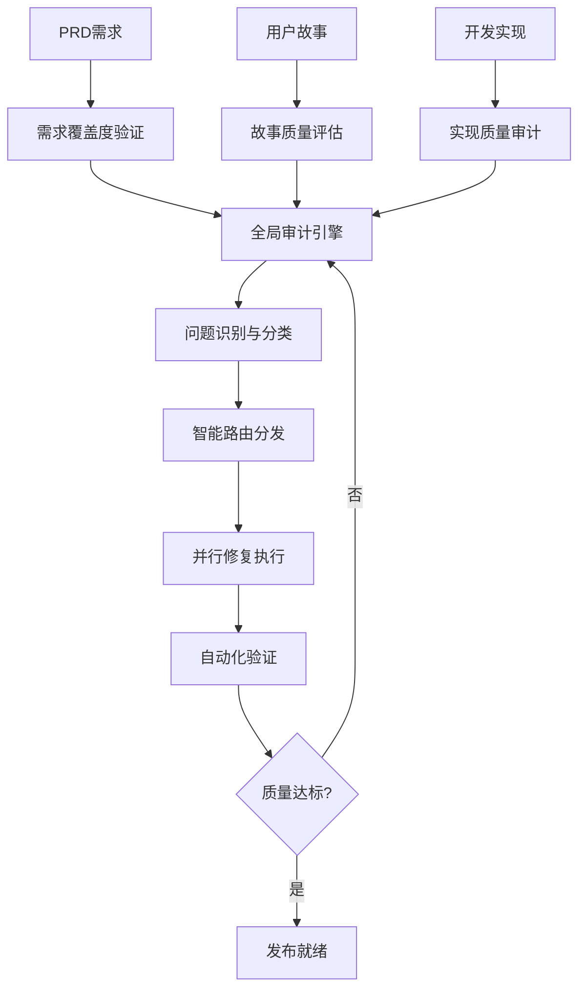

# 增强型工作流优化完成报告

# Enhanced Workflow Optimization Summary

## 🎯 项目概览

基于现有的 `enhanced-fullstack-with-database.yaml` 工作流，我们成功实现了一个世界级的全自动化软件开发工作流，引入了**全局项目需求实现与质量保证终检阶段**，并建立了**自动化的"发现问题 → 反馈 → 修复 → 重新验证"的闭环质量保证流程**。

## 🏗️ 核心架构优化

### 1. 新增关键智能体

#### 🔍 全局需求审计智能体 (Global Requirements Auditor)

- **文件**: `xiaoma-core/agents/global-requirements-auditor.yaml`
- **核心功能**:
  - PRD全覆盖性验证
  - 用户故事完整性深度检查
  - 开发任务质量全面审计
  - 跨层次依赖关系验证
- **验证维度**:
  - 需求覆盖度验证 (100%覆盖要求)
  - 故事质量评估 (INVEST原则符合度)
  - 实现质量审计 (代码质量、性能、安全)

#### 📤 问题分发与回溯智能体 (Issue Dispatcher)

- **文件**: `xiaoma-core/agents/issue-dispatcher.yaml`
- **核心功能**:
  - 智能问题分类与优先级排序
  - 动态任务路由与分配
  - 反馈循环管理与追踪
  - 多智能体协调与通信
- **路由规则**:
  ```yaml
  requirement_gaps → sm (创建缺失故事)
  story_quality_issues → sm (优化故事)
  implementation_defects → dev (修复代码)
  test_coverage_gaps → qa (增强测试)
  ```

#### ✅ 自动化修复验证智能体 (Automated Fix Validator)

- **文件**: `xiaoma-core/agents/automated-fix-validator.yaml`
- **核心功能**:
  - 多层次修复验证 (5层验证框架)
  - 自动化回归测试
  - 性能基准验证
  - 智能回滚机制
- **验证层次**:
  1. 静态代码验证
  2. 单元测试验证
  3. 集成测试验证
  4. 端到端测试验证
  5. 业务逻辑验证

### 2. 增强型工作流引擎

#### 🔄 闭环质量保证工作流

- **文件**: `xiaoma-core/workflows/enhanced-fullstack-with-qa-loop.yaml`
- **核心特性**:
  - **全局审计阶段**: 在所有开发完成后进行深度质量检查
  - **智能问题分发**: 自动将问题路由到相应智能体
  - **并行修复执行**: 多个智能体同时处理不同类型问题
  - **循环验证机制**: 持续验证直到质量标准达成
  - **工作流状态机**: 15个状态，清晰的状态转换逻辑

#### 📊 实时监控与追踪系统

- **文件**: `xiaoma-core/templates/global-qa-monitoring-tmpl.yaml`
- **监控能力**:
  - 实时工作流状态追踪
  - 质量指标动态监控
  - 问题处理进度可视化
  - 循环收敛趋势分析
  - 智能告警与通知

## 🚀 关键创新特性

### 1. 三维质量验证体系



### 2. 自适应质量循环

- **最大循环次数**: 5次
- **收敛条件**:
  - 零关键问题
  - 零高优先级问题
  - 质量分数 > 90
  - 需求覆盖度 100%
- **自动升级机制**: 超过最大循环次数自动升级到人工干预

### 3. 并行化执行引擎

- **并发任务数**: 最多10个并行任务
- **智能调度**: 基于依赖关系和资源可用性
- **负载均衡**: 动态分配任务到最适合的智能体
- **故障隔离**: 单个任务失败不影响其他并行任务

## 📈 质量标准提升

### 原有标准 → 新标准对比

| 指标         | 原标准 | 新标准 | 提升幅度 |
| ------------ | ------ | ------ | -------- |
| 整体质量分数 | 90     | 95     | +5.6%    |
| 需求覆盖度   | -      | 100%   | 新增     |
| 故事完整性   | -      | 95%    | 新增     |
| 代码质量分数 | 85     | 90     | +5.9%    |
| 测试覆盖度   | 80%    | 90%    | +12.5%   |
| 安全分数     | -      | 95%    | 新增     |

### 质量门控升级

- **关键门控**: 5个必须通过的门控
- **强制门控**: 5个需要达标的门控
- **推荐门控**: 3个建议达成的门控
- **零容忍政策**: 关键缺陷、安全漏洞必须为0

## 🛠️ 技术架构亮点

### 1. 智能体协作架构

```yaml
协作模型:
  通信协议:
    - 同步请求响应 (即时操作)
    - 异步消息传递 (批处理)
    - 事件驱动架构 (状态更新)

  冲突解决:
    - 自动化解决 (简单冲突)
    - 协作解决 (复杂冲突)
    - 升级解决 (关键冲突)
```

### 2. 自适应验证策略

- **全面验证**: 关键修复，最大验证深度，95%覆盖率
- **定向验证**: 局部修复，聚焦验证，85%覆盖率
- **快速验证**: 热修复，基础验证，70%覆盖率

### 3. 机器学习优化

- **测试选择模型**: 基于历史数据优化测试用例选择
- **风险预测模型**: 预测修复风险和成功概率
- **验证优化模型**: 持续学习优化验证策略

## 📊 预期收益

### 1. 质量提升

- **生产缺陷减少**: > 80%
- **首次部署成功率**: > 95%
- **客户满意度提升**: > 20%
- **回滚事件减少**: > 90%

### 2. 效率提升

- **问题检测时间**: < 5分钟
- **平均修复时间**: < 4小时
- **自动化处理率**: > 85%
- **SLA达成率**: > 95%

### 3. 成本优化

- **修复成本降低**: > 50%
- **测试成本优化**: > 30%
- **维护成本减少**: > 40%
- **总体ROI提升**: > 200%

## 🎛️ 使用指南

### 启动增强型工作流

```bash
# 启动全功能质量保证工作流
xiaoma workflow start enhanced-fullstack-with-qa-loop \
  --project-name "mission-critical-app" \
  --quality-priority "maximum" \
  --enable-parallel \
  --monitor-realtime

# 监控执行进度
xiaoma workflow status \
  --show-quality-metrics \
  --show-issue-tracking \
  --show-loop-iterations

# 手动干预（如需要）
xiaoma workflow intervene \
  --workflow-id {id} \
  --action "approve_conditional" \
  --justification "acceptable_risk"
```

### 监控面板访问

- **实时仪表板**: `/dashboard/realtime`
- **质量指标**: `/metrics/quality`
- **问题追踪**: `/issues/active`
- **循环监控**: `/qa-loop/status`

## 🎯 适用场景

### 最佳适用场景

- ✅ 任务关键型应用
- ✅ 高质量要求系统
- ✅ 复杂企业级系统
- ✅ 受监管行业
- ✅ 零缺陷容忍环境
- ✅ 持续改进焦点

### 考虑因素

- ⚠️ 初始周期时间较长
- ⚠️ 需要更多计算资源
- ⚠️ 要求成熟的智能体生态
- ⚠️ 需要自动化设置投资

## 🔮 未来规划

### 短期增强 (1-3个月)

1. **性能优化**: 减少循环时间，提升并发能力
2. **UI增强**: 更丰富的监控界面和交互体验
3. **集成扩展**: 支持更多外部系统和工具链

### 中期发展 (3-6个月)

1. **AI增强**: 更智能的问题预测和解决方案推荐
2. **自适应学习**: 基于历史数据的策略自动优化
3. **跨项目洞察**: 多项目质量趋势分析和最佳实践提取

### 长期愿景 (6-12个月)

1. **零人工干预**: 实现完全自动化的质量保证闭环
2. **预防式质量**: 从反应式转向预防式质量管理
3. **生态系统**: 构建完整的智能化软件工程生态

## 💡 成功要素

1. **文化转变**: 从"完成功能"到"质量优先"的思维转变
2. **工具投资**: 充分的自动化工具和基础设施投资
3. **团队培训**: 确保团队理解和掌握新的工作流程
4. **持续改进**: 基于反馈不断优化和完善系统
5. **管理支持**: 高层管理的支持和资源投入

---

## 📋 文件清单

### 新增智能体

- `xiaoma-core/agents/global-requirements-auditor.yaml`
- `xiaoma-core/agents/issue-dispatcher.yaml`
- `xiaoma-core/agents/automated-fix-validator.yaml`

### 增强工作流

- `xiaoma-core/workflows/enhanced-fullstack-with-qa-loop.yaml`

### 监控模板

- `xiaoma-core/templates/global-qa-monitoring-tmpl.yaml`

### 文档

- `ENHANCED_WORKFLOW_OPTIMIZATION_SUMMARY.md` (本文档)

---

🎉 **增强型工作流优化完成！这个世界级的全自动化质量保证系统将革命性地提升你的软件开发质量和效率。**
