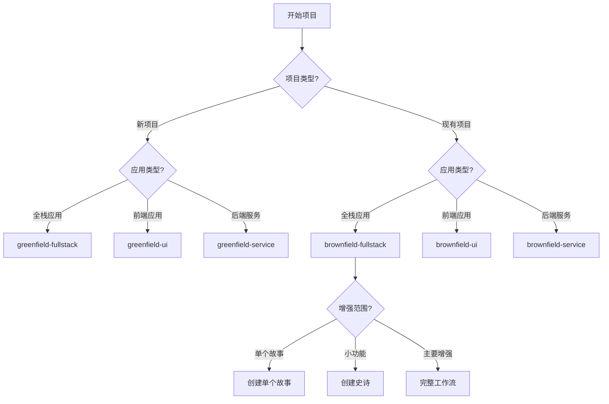

# XIAOMA-CLI™ 工作流与智能体编排详细分析文档

## 概述

XIAOMA-CLI™ 框架内置了 **6种核心工作流**，每种工作流都通过精心设计的智能体编排和命令序列来实现特定的软件开发场景。这些工作流代表了从项目构思到代码实现的完整开发生命周期管理。

## 工作流分类体系

### 按项目类型分类

- **Greenfield（新项目）工作流**: 从零开始的新项目开发
- **Brownfield（现有项目）工作流**: 现有项目的增强和修改

### 按应用架构分类

- **Fullstack（全栈）**: 前后端一体化应用
- **UI/Frontend（前端）**: 纯前端应用
- **Service/API（服务）**: 后端服务和API

## 六种核心工作流详细分析

### 1. 新项目全栈应用开发工作流 (greenfield-fullstack)

**适用场景**:

- 构建生产级应用程序
- 多团队成员参与
- 复杂功能需求
- 需要全面文档
- 长期维护预期
- 企业或面向客户的应用

#### 智能体编排序列

##### 阶段一：规划与设计 (Planning & Design)

```
1. analyst (分析师) → project-brief.md
   - 可选操作: brainstorming_session, market_research_prompt
   - 输出: 项目简介文档

2. pm (产品经理) → prd.md
   - 依赖: project-brief.md
   - 输出: 产品需求文档

3. ux-expert (UX专家) → front-end-spec.md
   - 依赖: prd.md
   - 可选操作: user_research_prompt
   - 输出: 前端规范文档

4. ux-expert (UX专家) → v0_prompt (可选)
   - 依赖: front-end-spec.md
   - 条件: user_wants_ai_generation
   - 输出: AI UI生成提示

5. architect (架构师) → fullstack-architecture.md
   - 依赖: prd.md, front-end-spec.md
   - 可选操作: technical_research_prompt, review_generated_ui_structure
   - 输出: 全栈架构文档
```

##### 阶段二：验证与修正 (Validation & Correction)

```
6. pm (产品经理) → 更新 prd.md (如需要)
   - 依赖: fullstack-architecture.md
   - 条件: architecture_suggests_prd_changes

7. po (产品负责人) → 验证所有工件
   - 使用: po-master-checklist
   - 可能触发: 各智能体修正文档
```

##### 阶段三：开发准备 (Development Preparation)

```
8. po (产品负责人) → 分片文档
   - 创建: docs/prd/ 和 docs/architecture/ 分片内容
   - 为IDE开发做准备
```

##### 阶段四：迭代开发循环 (Iterative Development Cycle)

```
9. sm (Scrum Master) → 创建故事
   - 依赖: sharded_docs
   - 输出: story.md (状态: Draft)

10. analyst/pm → 审查故事草稿 (可选)
    - 更新故事状态: Draft → Approved

11. dev (开发者) → 实现故事
    - 输出: 实现文件
    - 更新故事状态: → Review

12. qa (质量保证) → 审查实现 (可选)
    - 可能触发: dev 修复问题
    - 更新故事状态: Review → Done
```

##### 阶段五：项目完成 (Project Completion)

```
13. po (产品负责人) → 史诗回顾 (可选)
    - 条件: epic_complete
    - 输出: epic-retrospective.md
```

#### 命令编排关键特性

**决策点和分支逻辑**:

- AI UI生成选择：是否使用v0/Lovable等工具
- 架构反馈循环：架构可能建议PRD修改
- QA审查选择：可选的质量保证步骤
- 故事审查选择：可选的故事草稿审查

**交接提示模板**:

```yaml
analyst_to_pm: '项目简介已完成。保存为docs/project-brief.md，然后创建PRD'
pm_to_ux: 'PRD就绪。保存为docs/prd.md，然后创建UI/UX规范'
ux_to_architect: 'UI/UX规范完成。保存为docs/front-end-spec.md，然后创建全栈架构'
```

### 2. 现有项目全栈增强工作流 (brownfield-fullstack)

**适用场景**:

- 功能添加
- 重构
- 现代化改造
- 集成增强

#### 智能体编排序列

##### 阶段一：分类与路由 (Classification & Routing)

```
1. analyst (分析师) → 分类增强范围
   决策路由:
   - 单个故事 (< 4小时) → pm.brownfield-create-story → 退出
   - 小功能 (1-3个故事) → pm.brownfield-create-epic → 退出
   - 主要增强 → 继续完整工作流
```

##### 阶段二：现有系统分析 (Existing System Analysis)

```
2. analyst (分析师) → 检查现有文档
   条件分支:
   - 文档充分 → 跳过document-project
   - 文档不充分 → architect.document-project

3. architect (架构师) → 项目分析 (如需要)
   - 使用: document-project任务
   - 输出: brownfield-architecture.md
```

##### 阶段三：规划设计 (Planning & Design)

```
4. pm (产品经理) → brownfield PRD
   - 使用: brownfield-prd-tmpl
   - 依赖: existing_documentation_or_analysis

5. architect (架构师) → 架构文档 (如需要)
   - 条件: architecture_changes_needed
   - 使用: brownfield-architecture-tmpl
```

##### 阶段四：后续流程

与新项目工作流相同的验证、开发循环和完成阶段。

#### 关键创新特性

**智能路由系统**:

```yaml
routes:
  single_story:
    agent: pm
    uses: brownfield-create-story
    exit: true
  small_feature:
    agent: pm
    uses: brownfield-create-epic
    exit: true
  major_enhancement:
    continue: full_workflow
```

**文档评估逻辑**:

```yaml
documentation_check:
  adequate: 跳过document-project，直接进入PRD
  inadequate: 执行document-project，然后进入PRD
```

### 3. 新项目UI开发工作流 (greenfield-ui)

**适用场景**:

- SPA (单页应用)
- 移动应用
- 微前端
- 静态站点
- UI原型
- 简单界面

#### 智能体编排序列

与新项目全栈类似，但专注于前端：

```
analyst → pm → ux-expert → [v0_prompt] → architect (前端架构) → po → 开发循环
```

**关键差异**:

- 使用 `front-end-architecture-tmpl` 而不是 `fullstack-architecture-tmpl`
- 项目设置指导专注于前端项目结构
- 架构师专注于前端技术选择和组件设计

### 4. 现有项目UI增强工作流 (brownfield-ui)

**适用场景**:

- UI现代化
- 框架迁移
- 设计刷新
- 前端增强

#### 智能体编排序列

```
architect (UI分析) → pm (现有项目PRD) → ux-expert → architect (现有项目架构) → po → 开发循环
```

**特殊特性**:

- 强制UI分析步骤
- 专注于现有设计模式集成
- 组件集成策略和迁移规划

### 5. 新项目服务开发工作流 (greenfield-service)

**适用场景**:

- REST API
- GraphQL API
- 微服务
- 后端服务
- API原型
- 简单服务

#### 智能体编排序列

```
analyst → pm → architect (服务架构) → po → 开发循环
```

**关键特性**:

- 跳过UX专家步骤
- 直接从PM到架构师
- 专注于API设计和服务架构
- 使用 `architecture-tmpl` 进行后端架构

### 6. 现有项目服务增强工作流 (brownfield-service)

**适用场景**:

- 服务现代化
- API增强
- 微服务提取
- 性能优化
- 集成增强

#### 智能体编排序列

```
architect (服务分析) → pm (现有项目PRD) → architect (现有项目架构) → po → 开发循环
```

**特殊关注**:

- 服务集成安全性
- API兼容性验证
- 性能指标分析
- 集成依赖性管理

## 智能体角色矩阵

### 按工作流阶段的智能体参与度

| 智能体           | 规划设计 | 验证修正 | 开发准备 | 迭代开发 | 项目完成 |
| ---------------- | -------- | -------- | -------- | -------- | -------- |
| **Orchestrator** | 协调     | -        | -        | -        | -        |
| **Analyst**      | 必须     | 可选     | -        | 可选审查 | -        |
| **PM**           | 必须     | 可能     | -        | 可选审查 | -        |
| **UX Expert**    | UI工作流 | -        | -        | -        | -        |
| **Architect**    | 必须     | -        | -        | -        | -        |
| **PO**           | -        | 必须     | 必须     | -        | 可选     |
| **SM**           | -        | -        | -        | 必须     | -        |
| **Dev**          | -        | -        | -        | 必须     | -        |
| **QA**           | -        | -        | -        | 可选     | -        |

### 智能体命令使用频率统计

#### 高频命令 (所有工作流)

- `*help`: 显示可用命令
- `*create-prd`: PM创建产品需求文档
- `*create-*-architecture`: 架构师创建架构文档
- `*shard-doc`: PO分片文档
- `*draft`: SM创建故事
- `*develop-story`: Dev实现故事
- `*doc-out`: 输出完整文档

#### 工作流特定命令

**新项目工作流专有**:

- `*create-project-brief`: 分析师创建项目简介
- `*generate-ui-prompt`: UX专家生成UI提示

**现有项目工作流专有**:

- `*document-project`: 架构师分析现有项目
- `*brownfield-create-story`: PM创建现有项目故事
- `*brownfield-create-epic`: PM创建现有项目史诗

**UI工作流专有**:

- `*create-front-end-spec`: UX专家创建前端规范
- `*create-front-end-architecture`: 架构师创建前端架构

## 工作流决策树

### 工作流选择决策逻辑



## 工作流最佳实践

### 1. 工作流选择指南

**何时使用新项目工作流**:

- 构建生产级应用程序
- 多团队成员参与
- 复杂功能需求
- 需要全面文档和测试
- 长期维护预期

**何时使用现有项目工作流**:

- 增强需要协调的故事
- 需要架构变更
- 需要风险评估和缓解规划
- 多团队成员将处理相关更改

### 2. 智能体交接最佳实践

**标准交接模式**:

```yaml
完成工作 → 保存文档 → 通知下一个智能体 → 传递依赖信息
```

**示例交接提示**:

```yaml
'PRD已准备就绪。保存为docs/prd.md，然后创建UI/UX规范。'
```

### 3. 错误处理和修正流程

**PO验证循环**:

```yaml
PO发现问题 → 返回相关智能体 → 修复并重新导出 → PO重新验证
```

**QA反馈循环**:

```yaml
QA发现问题 → Dev修复 → 返回QA确认 → 标记完成
```

### 4. 可选步骤策略

**规划阶段可选操作**:

- 头脑风暴会话
- 市场研究
- 用户研究
- 技术研究

**开发阶段可选操作**:

- 故事草稿审查
- QA代码审查
- 史诗回顾

## 工作流扩展性

### 自定义工作流创建

**工作流文件结构**:

```yaml
workflow:
  id: custom-workflow-id
  name: 自定义工作流名称
  description: 描述
  type: greenfield|brownfield
  project_types: [支持的项目类型]
  sequence: [智能体编排序列]
  flow_diagram: mermaid图表
  decision_guidance: 决策指导
  handoff_prompts: 交接提示
```

### 智能体团队配置

**team-fullstack.yaml示例**:

```yaml
bundle:
  name: Team Fullstack
  icon: 🚀
  description: 能够进行全栈、纯前端或服务开发的团队
agents:
  - xiaoma-orchestrator # 协调器
  - analyst # 分析师
  - pm # 产品经理
  - ux-expert # UX专家
  - architect # 架构师
  - po # 产品负责人
workflows:
  - brownfield-fullstack.yaml
  - brownfield-service.yaml
  - brownfield-ui.yaml
  - greenfield-fullstack.yaml
  - greenfield-service.yaml
  - greenfield-ui.yaml
```

## 性能优化和并行处理

### 工作流并行化机会

**规划阶段**:

- 分析师市场研究 || UX专家用户研究
- 架构师技术研究 || PM需求细化

**开发阶段**:

- 多个故事并行开发（不同史诗）
- 前端开发 || 后端开发（全栈项目）

### 缓存和状态管理

**智能体状态保持**:

- 当前工作流状态
- 已完成的任务检查点
- 文档版本跟踪
- 依赖关系图

## 监控和度量

### 工作流执行指标

**时间指标**:

- 各阶段平均完成时间
- 智能体响应时间
- 整体工作流执行时间

**质量指标**:

- PO验证通过率
- QA审查发现问题数
- 返工率

**协作指标**:

- 智能体间交接成功率
- 文档完整性评分
- 用户满意度

## 总结

XIAOMA-CLI™的六种工作流代表了现代软件开发的最佳实践，通过：

1. **智能分类**: 自动识别项目类型和复杂度
2. **精确编排**: 每个智能体在正确的时间执行正确的任务
3. **灵活适应**: 支持可选步骤和条件分支
4. **质量保证**: 内置验证和反馈循环
5. **可扩展性**: 支持自定义工作流和智能体团队

这种工作流设计确保了从项目构思到代码实现的无缝衔接，解决了AI辅助开发中的规划不一致和上下文丢失问题，为现代软件开发团队提供了一个强大而灵活的协作框架。
