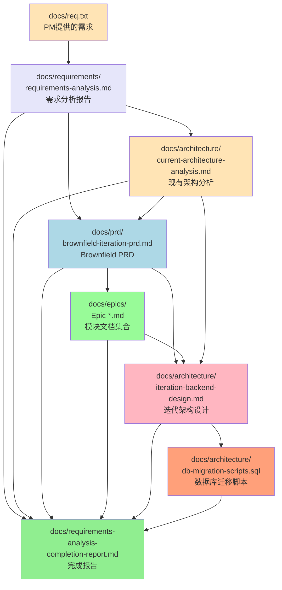
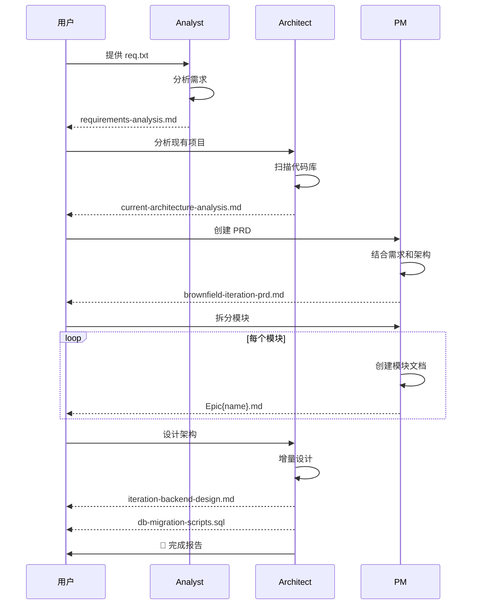

# automated-requirements-analysis.yaml 工作流输出文档清单

## 工作流概述

**工作流ID**: `automated-requirements-analysis`
**用途**: 从 req.txt 需求文档到 PRD 生成和 Epic 拆分的全自动化流程
**适用场景**: 现有 Java 后端项目的迭代需求开发（Brownfield 项目）
**总耗时**: 约 1.5-2.5 小时

## 📄 生成的文档清单

### 1. 需求分析阶段（Analyst 智能体）

#### 1.1 需求分析报告

- **文件路径**: `docs/requirements/requirements-analysis.md`
- **生成智能体**: Analyst
- **生成时机**: 第1步 - 需求分析和澄清阶段
- **文档内容**:

  ```markdown
  ## 1. 需求概览

  - 项目背景和目标
  - 业务价值主张
  - 核心功能摘要

  ## 2. 需求分类清单

  - 功能需求（按模块分类）
  - 非功能需求
  - 数据需求
  - 接口需求
  - 约束条件

  ## 3. 用户和场景

  - 目标用户角色定义
  - 典型使用场景
  - 用户旅程地图

  ## 4. 需求澄清记录

  - 原始需求中的不明确点
  - 澄清后的明确需求
  - 补充的需求细节

  ## 5. 需求优先级

  - 高优先级需求（Must Have）
  - 中优先级需求（Should Have）
  - 低优先级需求（Could Have）
  - 未来考虑（Won't Have This Time）

  ## 6. 依赖关系分析

  - 功能依赖关系图
  - 技术依赖识别
  - 数据依赖识别

  ## 7. 风险和约束

  - 识别的业务风险
  - 识别的技术约束
  - 资源和时间约束
  - 风险缓解建议

  ## 8. 实施建议

  - 建议的开发阶段划分
  - MVP（最小可行产品）范围
  - 迭代计划建议
  ```

#### 1.2 项目简报（可选）

- **文件路径**: `docs/brief.md`
- **生成智能体**: Analyst
- **生成时机**: 第1步（可选）
- **文档内容**: 简洁的项目概览、目标、关键里程碑

---

### 2. 架构分析阶段（Architect 智能体）

#### 2.1 现有架构分析报告 ⭐

- **文件路径**: `docs/architecture/current-architecture-analysis.md`
- **生成智能体**: Architect
- **生成时机**: 第2步 - 分析现有架构
- **文档内容**:

  ```markdown
  ## 1. 项目概览

  - 项目名称
  - 技术栈版本清单
  - 项目规模统计（类数量、接口数量等）

  ## 2. 技术架构

  - 框架和依赖清单
    - Spring Boot 版本
    - 持久化框架（MyBatis/MyBatis-Plus/JPA）
    - 数据库类型和版本
    - 其他关键依赖（Redis/Kafka等）
  - 分层架构说明
  - 关键技术组件

  ## 3. 数据库架构

  - 数据库类型和版本（MySQL/PostgreSQL）
  - 现有数据表清单
    - 表名
    - 用途说明
    - 主要字段
  - ER 关系说明
  - 数据库设计模式

  ## 4. API 架构

  - API 模块清单
  - RESTful 端点统计
  - API 版本策略
  - 请求/响应规范

  ## 5. 代码组织

  - 包结构说明
  - 分层职责定义（Controller-Service-Mapper/Repository）
  - 公共组件和工具类

  ## 6. 架构特点和注意事项

  - 遵循的设计原则
  - 编码规范要点
  - 技术约束
  - 已知技术债务

  ## 7. 迭代开发建议

  - 新增功能的集成点
  - 需要遵循的规范
  - 兼容性注意事项
  ```

---

### 3. PRD 创建阶段（PM 智能体）

#### 3.1 Brownfield 迭代 PRD 文档 ⭐⭐

- **文件路径**: `docs/prd/brownfield-iteration-prd.md`
- **生成智能体**: PM
- **生成时机**: 第3步 - 创建 Brownfield PRD
- **输入来源**:
  - `docs/req.txt` - PM 提供的原始需求
  - `docs/architecture/current-architecture-analysis.md` - 现有架构上下文
- **文档内容**:

  ```markdown
  # PRD 元数据

  - 标题、版本、作者、创建日期、状态

  ## 1. 需求概述

  - 迭代背景和目标
  - 目标用户群体
  - 业务价值说明

  ## 2. 目标用户和使用场景

  - 用户角色定义
  - 典型使用场景描述
  - 用户旅程地图

  ## 3. 功能需求详细描述

  - 功能模块清单
  - 每个功能的详细描述
  - 业务规则和约束
  - 数据流和处理逻辑

  ## 4. 非功能需求

  - 性能要求（响应时间、并发量）
  - 安全要求（认证、授权、数据保护）
  - 兼容性要求（浏览器、移动端、API版本）
  - 可用性和可维护性要求

  ## 5. 技术约束（基于现有架构）

  - 必须使用的技术栈
  - 必须遵循的架构模式
  - 不能修改的现有组件
  - 技术兼容性约束

  ## 6. 数据需求（数据库变更）

  - 新增数据表清单
  - 修改现有表的变更说明
  - 数据迁移策略
  - 数据关联关系

  ## 7. API 需求（新增/修改的接口）

  - RESTful API 端点清单
  - 请求/响应数据结构
  - API 版本策略
  - 与现有 API 的集成点

  ## 8. 验收标准

  - 功能验收标准（可测试、可验证）
  - 性能验收标准
  - 质量验收标准

  ## 9. 实施计划（模块拆分建议）

  - 建议的模块划分
  - 优先级排序
  - 依赖关系说明
  - 预估工作量
  ```

---

### 4. Epic 拆分阶段（PM 智能体）

#### 4.1 模块文档集合 ⭐

- **文件路径**: `docs/epics/Epic{epic_name}.md`（多个文件）
- **生成智能体**: PM
- **生成时机**: 第3步 - Epic 拆分循环
- **生成数量**: 根据 PRD 建议，通常 3-8 个模块
- **每个模块文档内容**:

  ```markdown
  # 模块元数据

  - epic_id: Epic-01, Epic-02, ...
  - epic_name: 模块名称
  - status: Planned
  - priority: 高/中/低
  - created_date: 创建日期

  ## 1. 模块概述

  - 模块目标
  - 业务价值
  - 成功标准

  ## 2. 用户故事清单（初步识别）

  - 故事清单（5-15个故事）
  - 故事优先级
  - 故事依赖关系

  ## 3. 技术设计概要（针对此模块）

  - 技术组件
  - 架构设计
  - 技术方案

  ## 4. 数据库变更（针对此模块）

  - 新增表
  - 修改表
  - 数据迁移

  ## 5. API 接口清单（针对此模块）

  - API 端点清单
  - 接口概要

  ## 6. 验收标准（模块级别）

  - 模块验收标准
  - 质量标准

  ## 7. 估算工作量

  - 故事数量
  - 工作量预估
  - 风险和不确定性

  ## 8. 风险和注意事项

  - 技术风险
  - 业务风险
  - 依赖风险
  - 缓解措施
  ```

---

### 5. 架构设计阶段（Architect 智能体）

#### 5.1 迭代后端架构增量设计文档 ⭐⭐⭐（核心架构文档）

- **文件路径**: `docs/architecture/iteration-backend-design.md`
- **生成智能体**: Architect
- **生成时机**: 第4步 - 后端架构增量设计
- **输入来源**:
  - `docs/prd/brownfield-iteration-prd.md`
  - `docs/epics/Epic-*.md`
  - `docs/architecture/current-architecture-analysis.md`
- **文档内容**（最详细的架构设计）:

  ````markdown
  # 架构设计元数据

  - 标题: 迭代后端架构增量设计
  - 版本号
  - 架构师: Architect Agent
  - 创建日期
  - 基于: current_architecture_analysis, prd_document, epic_documents

  ## 1. 设计概述

  - 设计概述
  - 设计原则
  - 技术选型

  ## 2. 新增数据模型设计 ⭐

  ### 2.1 新增 Entity 实体类（Java Entity）

  - 类名、包名
  - 字段定义（类型、注解）
  - 关联关系（@OneToMany, @ManyToOne, @ManyToMany）
  - JPA/Hibernate 注解配置

  ### 2.2 数据表结构设计（DDL）

  - 完整的 CREATE TABLE 语句
  - 主键、外键、索引定义
  - 字段类型、长度、默认值、注释
  - 约束条件（唯一、非空等）

  ### 2.3 与现有实体的关联关系

  - 外键关系
  - 关联表设计（多对多）
  - 级联操作策略

  ### 2.4 数据迁移策略

  - 新表创建脚本
  - 现有表修改脚本（ALTER TABLE）
  - 数据初始化脚本
  - 回滚方案

  ## 3. API 设计 ⭐

  ### 3.1 新增 RESTful API 端点列表

  - HTTP 方法（GET/POST/PUT/DELETE）
  - URL 路径设计
  - 路径参数和查询参数
  - 请求 Body 结构
  - 响应数据结构
  - HTTP 状态码

  ### 3.2 请求/响应 DTO 设计

  - DTO 类名和包名
  - 字段定义和验证注解
  - DTO 与 Entity 的映射关系

  ### 3.3 API 版本策略

  - 版本号规则
  - 向后兼容性保证
  - 废弃策略

  ### 3.4 与现有 API 的集成点

  - 复用现有 API
  - 扩展现有 API
  - API 组合调用

  ## 4. 服务层设计 ⭐

  ### 4.1 新增 Service 接口和实现

  - Service 接口定义
  - 方法签名和 JavaDoc
  - 业务逻辑流程
  - Service 实现类结构

  ### 4.2 业务逻辑流程图

  - 关键业务流程的流程图
  - 决策点和分支逻辑
  - 异常处理流程

  ### 4.3 事务边界设计

  - 事务传播策略
  - 事务隔离级别
  - 事务回滚规则

  ### 4.4 与现有服务的交互

  - 依赖的现有 Service
  - 服务间调用关系
  - 数据流转

  ## 5. 技术决策

  ### 5.1 新技术/组件的引入

  - 新增依赖说明
  - 版本选择理由
  - 与现有技术栈的兼容性

  ### 5.2 性能优化策略

  - 数据库查询优化（索引、分页）
  - 缓存策略（Redis/本地缓存）
  - 异步处理（线程池、消息队列）

  ### 5.3 安全性考虑

  - 认证和授权策略
  - 数据加密
  - SQL 注入防护
  - XSS 防护

  ### 5.4 缓存策略

  - 缓存位置（本地/分布式）
  - 缓存粒度
  - 缓存更新策略
  - 缓存失效策略

  ## 6. 数据库变更脚本（详细）

  ### 6.1 新增表的 DDL

  ```sql
  CREATE TABLE xxx (
    id BIGINT AUTO_INCREMENT PRIMARY KEY,
    field1 VARCHAR(255) NOT NULL COMMENT '字段1',
    field2 INT DEFAULT 0 COMMENT '字段2',
    created_at TIMESTAMP DEFAULT CURRENT_TIMESTAMP,
    updated_at TIMESTAMP DEFAULT CURRENT_TIMESTAMP ON UPDATE CURRENT_TIMESTAMP,
    INDEX idx_field1 (field1)
  ) ENGINE=InnoDB DEFAULT CHARSET=utf8mb4 COMMENT='表说明';
  ```
  ````

  ### 6.2 现有表的 ALTER 脚本

  ```sql
  ALTER TABLE existing_table ADD COLUMN new_field VARCHAR(100);
  ALTER TABLE existing_table ADD INDEX idx_new_field (new_field);
  ```

  ### 6.3 索引优化
  - 新增索引
  - 修改索引
  - 复合索引设计

  ### 6.4 数据迁移脚本
  - 数据初始化
  - 数据转换
  - 数据清理

  ## 7. 技术风险和注意事项

  ### 7.1 兼容性风险
  - API 兼容性
  - 数据库向后兼容
  - 依赖版本冲突

  ### 7.2 性能影响
  - 新增查询的性能评估
  - 数据量增长预测
  - 性能瓶颈识别

  ### 7.3 技术债务
  - 已知的设计妥协
  - 需要重构的遗留代码
  - 后续优化计划

  ## 8. 实施指导

  ### 8.1 开发顺序建议
  - 模块开发顺序
  - 依赖关系处理
  - 集成测试策略

  ### 8.2 测试策略
  - 单元测试覆盖率目标
  - 集成测试场景
  - 性能测试基准

  ### 8.3 部署注意事项
  - 数据库迁移步骤
  - 配置变更
  - 灰度发布建议

  ```

  ```

#### 5.2 数据库迁移脚本 ⭐⭐⭐（可直接执行）

- **文件路径**: `docs/architecture/db-migration-scripts.sql`
- **生成智能体**: Architect
- **生成时机**: 第4步 - 与架构设计文档同时生成
- **文件内容**:

  ```sql
  -- =============================================
  -- 数据库迁移脚本
  -- 项目: {项目名称}
  -- 版本: {版本号}
  -- 创建日期: {日期}
  -- 说明: 迭代需求的数据库变更脚本
  -- =============================================

  -- 1. 新增表
  CREATE TABLE new_table_1 (
    id BIGINT AUTO_INCREMENT PRIMARY KEY,
    field1 VARCHAR(255) NOT NULL COMMENT '字段1',
    field2 INT DEFAULT 0 COMMENT '字段2',
    created_at TIMESTAMP DEFAULT CURRENT_TIMESTAMP,
    updated_at TIMESTAMP DEFAULT CURRENT_TIMESTAMP ON UPDATE CURRENT_TIMESTAMP,
    INDEX idx_field1 (field1)
  ) ENGINE=InnoDB DEFAULT CHARSET=utf8mb4 COMMENT='新表1';

  CREATE TABLE new_table_2 (
    ...
  ) ENGINE=InnoDB DEFAULT CHARSET=utf8mb4 COMMENT='新表2';

  -- 2. 修改现有表
  ALTER TABLE existing_table_1
    ADD COLUMN new_field1 VARCHAR(100) COMMENT '新增字段1',
    ADD COLUMN new_field2 INT DEFAULT 0 COMMENT '新增字段2';

  ALTER TABLE existing_table_2
    ADD INDEX idx_new_field (new_field);

  -- 3. 数据迁移
  INSERT INTO new_table_1 (field1, field2)
  SELECT old_field1, old_field2
  FROM existing_table
  WHERE condition;

  -- 4. 回滚脚本（注释形式保存）
  -- 如需回滚，执行以下脚本：
  -- DROP TABLE IF EXISTS new_table_1;
  -- DROP TABLE IF EXISTS new_table_2;
  -- ALTER TABLE existing_table_1 DROP COLUMN new_field1;
  -- ALTER TABLE existing_table_1 DROP COLUMN new_field2;
  ```

---

### 6. 完成报告

#### 6.1 需求分析完成报告

- **文件路径**: `docs/requirements-analysis-completion-report.md`
- **生成智能体**: 系统自动生成
- **生成时机**: 工作流完成时
- **文档内容**:

  ```markdown
  # 需求分析自动化工作流完成报告

  ## 1. 工作流执行概况

  - 总耗时: {duration}
  - 成功完成的步骤: 6/6

  ## 2. 生成的文档清单

  - 需求分析报告: docs/requirements/requirements-analysis.md
  - 架构分析报告: docs/architecture/current-architecture-analysis.md
  - PRD 文档: docs/prd/brownfield-iteration-prd.md
  - Epic 文档: docs/epics/Epic\*.md ({count} 个)
  - 架构设计文档: docs/architecture/iteration-backend-design.md
  - 数据库脚本: docs/architecture/db-migration-scripts.sql

  ## 3. 下一步建议

  - 下一阶段: 用户故事创建和细化
  - 建议使用: automated-story-development.yaml 工作流
  - 前置条件已满足:
    - Epic 文档已创建
    - 数据库设计已完成
    - 架构设计已完成

  ## 4. 关键指标

  - 识别的 Epic 数量: {epic_count}
  - 识别的数据表数量: {table_count}
  - 识别的 API 端点数量: {api_count}
  - 预估的用户故事数量: {story_count}
  ```

---

## 📊 文档依赖关系图



---

## 🎯 核心架构文档重点说明

### ⭐⭐⭐ 最重要的架构文档

#### 1. `iteration-backend-design.md` - 迭代后端架构增量设计

**为什么最重要**:

- **直接可执行**: 包含完整的实现细节
- **技术蓝图**: Entity 类、数据表 DDL、API 端点、Service 设计
- **实施指导**: 开发顺序、测试策略、部署注意事项
- **开发依据**: 开发人员直接按此文档编码

**包含的关键信息**:

- ✅ Java Entity 类设计（完整字段和注解）
- ✅ 数据表 CREATE TABLE 语句
- ✅ RESTful API 端点列表（URL、方法、参数、响应）
- ✅ DTO 类设计
- ✅ Service 接口和实现
- ✅ 业务逻辑流程图
- ✅ 事务边界设计
- ✅ 性能优化策略
- ✅ 安全设计
- ✅ 缓存策略

#### 2. `db-migration-scripts.sql` - 数据库迁移脚本

**为什么重要**:

- **可直接执行**: 复制粘贴即可在数据库中运行
- **完整的 DDL**: 所有 CREATE TABLE 和 ALTER TABLE 语句
- **数据迁移**: 数据初始化和转换脚本
- **回滚方案**: 包含回滚脚本（注释形式）

**包含的关键信息**:

- ✅ 所有新增表的完整 CREATE TABLE 语句
- ✅ 现有表的 ALTER TABLE 语句
- ✅ 索引创建语句
- ✅ 数据迁移 INSERT/UPDATE 语句
- ✅ 回滚脚本

### ⭐⭐ 重要的上下文文档

#### 3. `current-architecture-analysis.md` - 现有架构分析

**作用**:

- 提供技术约束和规范
- 确保新设计与现有架构一致
- 识别现有数据表和 API
- 定义编码规范

#### 4. `brownfield-iteration-prd.md` - Brownfield PRD

**作用**:

- 定义所有功能需求
- 定义非功能需求
- 定义验收标准
- 建议模块拆分

#### 5. `Epic-*.md` - 模块文档集合

**作用**:

- 功能模块划分
- 初步识别用户故事
- 模块级别的技术概要
- 工作量估算

### ⭐ 分析和规划文档

#### 6. `requirements-analysis.md` - 需求分析报告

**作用**:

- 需求澄清和分类
- 用户角色和场景
- 依赖关系和优先级
- 风险识别

---

## 🔄 文档生成流程时序图



---

## 📋 质量保证

### 每个文档的质量检查

1. **requirements-analysis.md**:
   - ✅ 需求完整性 100%
   - ✅ 清晰度 ≥9/10
   - ✅ 优先级覆盖 100%
   - ✅ 依赖映射 ≥90%

2. **current-architecture-analysis.md**:
   - ✅ 技术栈识别完整
   - ✅ 现有数据表已列出
   - ✅ 现有 API 已记录
   - ✅ 编码规范已说明

3. **brownfield-iteration-prd.md**:
   - ✅ 需求覆盖率 100%
   - ✅ 清晰度 ≥9/10
   - ✅ 技术对齐度 100%
   - ✅ 可测试性 ≥9/10

4. **Epic\*.md**:
   - ✅ 模块规模适中（2-4周）
   - ✅ 故事数量合理（5-15个）
   - ✅ 技术设计一致
   - ✅ 数据库变更相对独立

5. **iteration-backend-design.md**:
   - ✅ 一致性 ≥9/10
   - ✅ 完整性 100%
   - ✅ 质量评分 ≥9/10
   - ✅ 可行性 ≥8/10

6. **db-migration-scripts.sql**:
   - ✅ SQL 语法正确
   - ✅ 所有表和字段已定义
   - ✅ 索引设计合理
   - ✅ 包含回滚方案

---

## 🚀 后续使用指南

### 1. 架构设计文档的使用

**开发阶段**:

```
iteration-backend-design.md
    ↓
【第2节】创建 Entity 类
    ↓
【第6节】执行数据库迁移脚本
    ↓
【第4节】创建 Service 接口和实现
    ↓
【第3节】创建 Controller 和 DTO
    ↓
【第8节】按实施指导进行测试和部署
```

**数据库变更**:

```bash
# 1. 审查 SQL 脚本
cat docs/architecture/db-migration-scripts.sql

# 2. 在测试环境执行
mysql -u user -p database < docs/architecture/db-migration-scripts.sql

# 3. 验证表结构
SHOW CREATE TABLE new_table_name;

# 4. 如需回滚，使用脚本中的回滚部分
```

### 2. 文档间的引用关系

- **开发时**: 主要看 `iteration-backend-design.md`
- **需要业务背景**: 查看 `brownfield-iteration-prd.md`
- **需要技术规范**: 查看 `current-architecture-analysis.md`
- **需要功能拆分**: 查看 `Epic-*.md`

### 3. 与下游工作流的衔接

生成的文档直接作为 `automated-story-development.yaml` 工作流的输入：

- ✅ Epic 文档已创建 → 用于生成用户故事
- ✅ 数据库设计已完成 → 指导数据层开发
- ✅ 架构设计已完成 → 指导服务层和 API 层开发

---

## 📈 总结

### 文档数量统计

| 类别         | 文档数量   | 核心程度   |
| ------------ | ---------- | ---------- |
| 需求分析     | 1-2个      | ⭐         |
| 架构分析     | 1个        | ⭐⭐       |
| PRD          | 1个        | ⭐⭐       |
| 模块         | 3-8个      | ⭐⭐       |
| **架构设计** | **2个**    | **⭐⭐⭐** |
| 完成报告     | 1个        | ⭐         |
| **总计**     | **9-15个** | -          |

### 最关键的架构文档

🏆 **Top 2 架构文档**（开发必读）:

1. **`iteration-backend-design.md`**
   - 完整的技术实现方案
   - Entity、DDL、API、Service 全覆盖
   - 直接指导开发编码

2. **`db-migration-scripts.sql`**
   - 可直接执行的 SQL 脚本
   - 数据库变更的唯一来源
   - 包含回滚方案

### 工作流价值

**自动化程度**: 90%
**人工介入点**: 需求审查、质量检查、最终批准
**时间节省**: 传统方式需 1-2 天，自动化仅需 1.5-2.5 小时
**质量保证**: 内置 18 项质量检查，确保文档一致性和完整性
