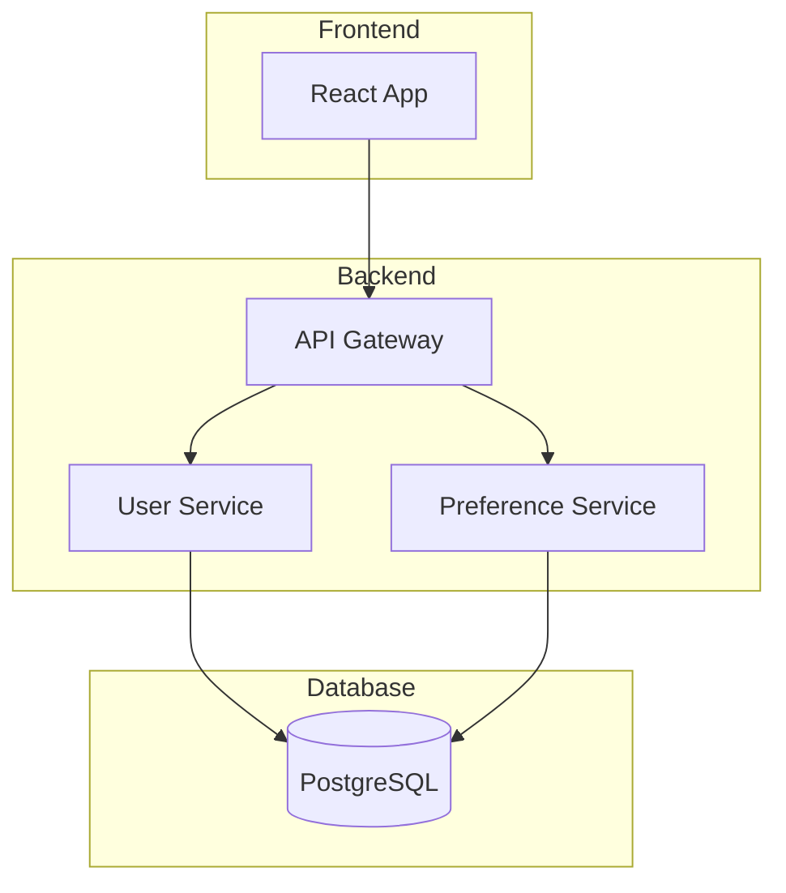
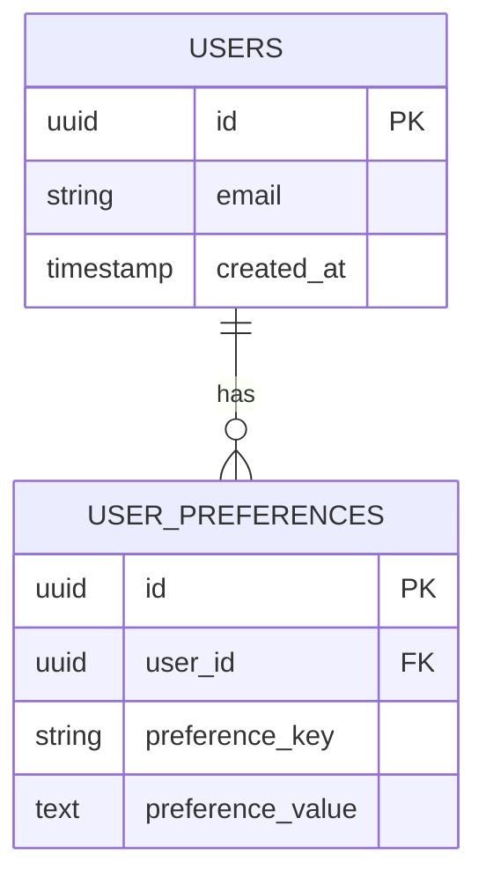

# Phase 3: 自动架构设计

> **工作流 ID**: phase-design
> **触发命令**: `*phase-design`
> **角色激活**: Architect (架构师)

---

## 阶段目标

基于 PRD 和现有代码库，自动生成技术架构设计，包括系统架构、数据模型、API 设计和技术决策记录。

---

## 输入要求

```yaml
inputs:
  required:
    - name: prd
      description: Phase 2 输出的 PRD 文档
      path: "prd.md"

    - name: epics
      description: 史诗文件
      path: "epics/"

    - name: stories
      description: 用户故事文件
      path: "stories/"

  auto_loaded:
    - name: technical_kb
      description: 技术知识库
      path: "knowledge-base/technical/"

    - name: existing_codebase
      description: 现有代码库
      path: "{project-root}/"

    - name: project_context
      description: 项目上下文
      path: "**/project-context.md"
```

---

## 执行步骤

### Step 3.1: 现有架构分析

**目标**: 深入分析现有代码库的架构

```yaml
task: analyze_existing_architecture
actions:
  - name: 扫描项目结构
    scan:
      - 目录结构
      - 文件类型分布
      - 依赖文件 (package.json, pom.xml, etc.)

  - name: 识别技术栈
    identify:
      - 前端框架
      - 后端框架
      - 数据库类型
      - 中间件

  - name: 识别架构模式
    patterns:
      - MVC/MVVM/MVP
      - 分层架构
      - 微服务/单体
      - 仓储模式

  - name: 识别可复用组件
    scan:
      - 通用工具类
      - 基础组件
      - 服务层接口
```

**输出格式**:

```yaml
existing_architecture:
  project_structure:
    root: "{project-root}"
    main_directories:
      - path: "src/"
        purpose: "源代码"
      - path: "tests/"
        purpose: "测试代码"

  tech_stack:
    frontend:
      framework: "React 18"
      state_management: "Redux"
      ui_library: "Ant Design"
    backend:
      framework: "Node.js + Express"
      orm: "Prisma"
    database:
      type: "PostgreSQL"
      version: "14"

  architecture_pattern: "分层架构"

  reusable_components:
    - path: "src/utils/"
      components: ["dateUtils", "stringUtils"]
    - path: "src/services/"
      components: ["apiService", "authService"]
```

---

### Step 3.2: 技术方案设计

**目标**: 设计满足 PRD 需求的技术实现方案

```yaml
task: design_technical_solution
actions:
  - name: 遍历功能需求
    for_each: fr in prd.functional_requirements
    do:
      - 分析实现方式
      - 识别需要的技术组件
      - 确定数据流

  - name: 查询技术知识库
    queries:
      - "推荐的实现模式"
      - "最佳实践"
      - "技术规范"

  - name: 设计组件架构
    design:
      - 新增组件
      - 修改组件
      - 组件间关系

  - name: 设计数据流
    design:
      - 请求流程
      - 数据转换
      - 状态管理
```

---

### Step 3.3: 数据模型设计

**目标**: 设计或修改数据库模型

```yaml
task: design_data_model
actions:
  - name: 分析现有数据模型
    scan:
      - 现有表结构
      - 实体关系
      - 索引设计

  - name: 设计新增/变更
    for_each: fr in prd.functional_requirements
    do:
      - 识别数据实体
      - 定义字段
      - 确定关系

  - name: 查询数据规范
    query_kb:
      - "数据库命名规范"
      - "字段类型规范"
      - "索引设计规范"

  - name: 生成 ER 图
    format: "Mermaid"

  - name: 设计迁移策略
    if: has_schema_changes
```

**数据模型模板**:

```yaml
data_model:
  new_tables:
    - name: "user_preferences"
      fields:
        - name: "id"
          type: "UUID"
          primary: true
        - name: "user_id"
          type: "UUID"
          foreign_key: "users.id"
        - name: "preference_key"
          type: "VARCHAR(100)"
        - name: "preference_value"
          type: "TEXT"
        - name: "created_at"
          type: "TIMESTAMP"
        - name: "updated_at"
          type: "TIMESTAMP"
      indexes:
        - columns: ["user_id"]
          type: "INDEX"
        - columns: ["user_id", "preference_key"]
          type: "UNIQUE"

  modified_tables:
    - name: "users"
      changes:
        - action: "ADD_COLUMN"
          column:
            name: "last_login_at"
            type: "TIMESTAMP"

  migration_strategy:
    approach: "non-breaking"
    steps:
      - "添加新表"
      - "添加新列"
      - "数据迁移脚本"
      - "更新索引"
```

---

### Step 3.4: API 设计

**目标**: 设计新增或修改的 API 接口

```yaml
task: design_api
actions:
  - name: 查询 API 规范
    query_kb:
      - "RESTful API 规范"
      - "响应格式规范"
      - "错误码规范"

  - name: 设计端点
    for_each: fr in prd.functional_requirements
    do:
      - 确定 HTTP 方法
      - 定义路径
      - 设计请求体
      - 设计响应体

  - name: 设计错误处理
    define:
      - 错误码
      - 错误消息
      - 错误响应格式

  - name: 设计认证授权
    if: requires_auth
```

**API 设计模板**:

```yaml
api_design:
  base_path: "/api/v1"

  endpoints:
    - path: "/users/{userId}/preferences"
      method: "GET"
      description: "获取用户偏好设置"
      auth_required: true
      request:
        path_params:
          - name: "userId"
            type: "string"
            required: true
        query_params:
          - name: "category"
            type: "string"
            required: false
      response:
        success:
          status: 200
          body:
            code: 200
            message: "success"
            data:
              preferences: "array"
        errors:
          - status: 404
            code: "USER_NOT_FOUND"
            message: "用户不存在"

    - path: "/users/{userId}/preferences"
      method: "PUT"
      description: "更新用户偏好设置"
      auth_required: true
      request:
        path_params:
          - name: "userId"
            type: "string"
        body:
          preference_key: "string"
          preference_value: "string"
      response:
        success:
          status: 200
```

---

### Step 3.5: 技术决策记录 (ADR)

**目标**: 记录关键技术决策及其依据

```yaml
task: create_adr
actions:
  - name: 识别决策点
    identify:
      - 技术选型
      - 架构模式选择
      - 实现方式选择

  - name: 记录决策
    for_each: decision_point
    do:
      - 描述上下文
      - 列出可选方案
      - 记录选择的方案
      - 说明理由
      - 引用知识库依据

  - name: 评估影响
    analyze:
      - 正面影响
      - 潜在风险
      - 缓解措施
```

**ADR 模板**:

```markdown
# ADR-001: [决策标题]

## 状态
已采纳

## 上下文
[为什么需要做这个决策？背景是什么？]

## 可选方案

### 方案 A: [方案名称]
- **描述**: [方案描述]
- **优点**: [优点列表]
- **缺点**: [缺点列表]

### 方案 B: [方案名称]
- **描述**: [方案描述]
- **优点**: [优点列表]
- **缺点**: [缺点列表]

## 决策
选择方案 [A/B]

## 理由
[为什么选择这个方案？]

## 知识库依据
- [技术规范引用]
- [最佳实践引用]

## 影响

### 正面影响
- [影响 1]

### 潜在风险
- [风险 1]

### 缓解措施
- [措施 1]

## 相关决策
- ADR-002: [相关决策]
```

---

### Step 3.6: 文件变更清单

**目标**: 生成需要修改/新增的文件清单

```yaml
task: generate_file_change_list
actions:
  - name: 汇总变更
    aggregate:
      - 新增文件
      - 修改文件
      - 删除文件

  - name: 映射到故事
    map_to: stories

  - name: 生成清单
    format: csv
```

**输出格式**:

```yaml
file_changes:
  new_files:
    - path: "src/models/UserPreference.ts"
      type: "model"
      story: "STORY-001"
      description: "用户偏好实体模型"

    - path: "src/services/preferenceService.ts"
      type: "service"
      story: "STORY-001"
      description: "偏好设置服务"

    - path: "src/controllers/preferenceController.ts"
      type: "controller"
      story: "STORY-001"
      description: "偏好设置控制器"

  modified_files:
    - path: "src/routes/index.ts"
      type: "router"
      story: "STORY-001"
      change: "添加偏好设置路由"

    - path: "prisma/schema.prisma"
      type: "schema"
      story: "STORY-001"
      change: "添加 UserPreference 模型"

  tests:
    - path: "tests/services/preferenceService.test.ts"
      type: "unit_test"
      story: "STORY-001"

    - path: "tests/controllers/preferenceController.test.ts"
      type: "integration_test"
      story: "STORY-001"
```

---

### Step 3.7: 生成架构文档

**完整的架构设计文档**:

```markdown
# 架构设计文档

## 文档信息
- **版本**: 1.0
- **创建日期**: [日期]
- **关联 PRD**: prd.md
- **知识库版本**: [版本号]

---

## 1. 系统架构概览

### 1.1 架构图



### 1.2 组件说明

| 组件 | 职责 | 技术栈 |
|-----|-----|-------|

---

## 2. 技术决策

### ADR-001: [决策标题]
[完整 ADR 内容]

---

## 3. 数据模型

### 3.1 ER 图



### 3.2 表结构设计

[详细表结构]

### 3.3 迁移策略

[迁移步骤]

---

## 4. API 设计

### 4.1 端点列表

| 方法 | 路径 | 描述 | 认证 |
|-----|-----|-----|-----|

### 4.2 详细设计

[每个端点的详细设计]

---

## 5. 文件变更清单

| 文件路径 | 类型 | 变更 | 关联故事 |
|---------|-----|-----|---------|

---

## 6. 非功能性考虑

### 6.1 性能优化
[性能设计]

### 6.2 安全措施
[安全设计]

### 6.3 可扩展性
[扩展设计]

---

## 7. 实现指南

### 7.1 开发顺序建议
[建议的实现顺序]

### 7.2 注意事项
[开发注意事项]
```

---

## 质量门禁

```yaml
quality_gates:
  - name: 架构完整性
    check: "架构设计覆盖所有 FR"
    threshold: 100%

  - name: 技术规范合规
    check: "设计符合技术知识库规范"
    threshold: 100%

  - name: ADR 完整性
    check: "所有关键决策都有 ADR"
    threshold: 100%

  - name: 文件映射完整
    check: "所有故事都映射到具体文件"
    threshold: 100%
```

---

## 状态更新

```yaml
phases:
  phase_3_design:
    status: "completed"
    started_at: "[时间戳]"
    completed_at: "[时间戳]"
    outputs:
      - "architecture.md"
      - "adr/"
      - "file-changes.csv"
    metrics:
      new_files: 8
      modified_files: 5
      adrs_created: 3
      api_endpoints: 6
    next_phase: "phase_4_develop"
```
