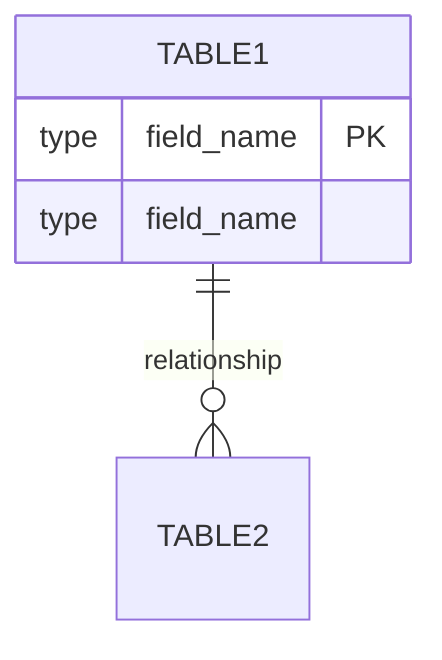

# 分析现有数据库

## 任务概述

连接到MySQL数据库并分析现有的数据库结构，生成或更新数据库文档。

## 执行步骤

### 1. 检查现有文档

```yaml
action: check_existing_documentation
path: docs/database/
pattern: '{project_name}-database.md'
```

### 2. 连接数据库

```yaml
action: connect_mysql_via_mcp
service: mysql-server
operation: |
  使用MCP mysql-server服务连接到数据库
  获取连接配置信息
```

### 3. 分析数据库结构

#### 3.1 获取所有表信息

```sql
SHOW TABLES;
```

#### 3.2 获取每个表的结构

```sql
DESCRIBE {table_name};
SHOW CREATE TABLE {table_name};
```

#### 3.3 获取外键关系

```sql
SELECT
    CONSTRAINT_NAME,
    TABLE_NAME,
    COLUMN_NAME,
    REFERENCED_TABLE_NAME,
    REFERENCED_COLUMN_NAME
FROM
    INFORMATION_SCHEMA.KEY_COLUMN_USAGE
WHERE
    REFERENCED_TABLE_NAME IS NOT NULL
    AND TABLE_SCHEMA = DATABASE();
```

#### 3.4 获取索引信息

```sql
SHOW INDEX FROM {table_name};
```

### 4. 生成关系图

生成Mermaid格式的ER图：



### 5. 生成文档

#### 文档结构模板：

```markdown
# {项目名称} 数据库设计文档

## 数据库概览

- **数据库名称**: {database_name}
- **字符集**: {charset}
- **排序规则**: {collation}
- **更新时间**: {timestamp}

## 表结构清单

{表列表和简要说明}

## 数据表详细设计

### 表名: {table_name}

**描述**: {table_description}

#### 字段定义

| 字段名  | 数据类型 | 允许空 | 默认值    | 主键  | 说明      |
| ------- | -------- | ------ | --------- | ----- | --------- |
| {field} | {type}   | {null} | {default} | {key} | {comment} |

#### 索引信息

| 索引名  | 字段      | 类型   | 唯一性   |
| ------- | --------- | ------ | -------- |
| {index} | {columns} | {type} | {unique} |

#### 外键约束

| 约束名       | 字段     | 参照表      | 参照字段     |
| ------------ | -------- | ----------- | ------------ |
| {constraint} | {column} | {ref_table} | {ref_column} |

## 数据库关系图

{Mermaid ER图}

## 数据字典

{详细的数据字典说明}
```

### 6. 更新或创建文档

```yaml
condition: document_exists
  true:
    action: compare_and_update
    steps:
      - 对比现有文档与数据库实际结构
      - 标记新增的表和字段
      - 标记删除的表和字段
      - 标记修改的字段属性
      - 更新文档并保留历史版本信息
  false:
    action: create_new_document
    path: "docs/database/{project_name}-database.md"
```

## 任务输出

- 完整的数据库设计文档
- 数据库关系图
- 变更记录（如果是更新）

## 注意事项

- 确保MCP mysql-server服务已配置
- 需要有数据库的读取权限
- 文档应包含版本控制信息
