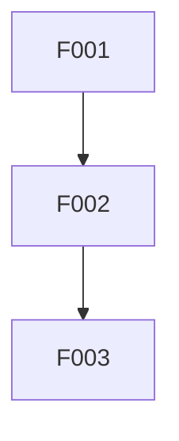
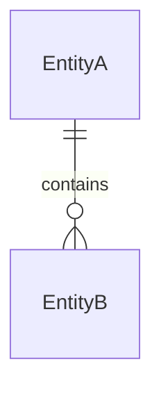

# 基于知识库的需求分析任务

## Purpose

通过结合外部需求文档(req.txt)和知识库(RAG/MCP)进行深度需求分析，输出结构化的需求分析报告，为后续PM智能体生成PRD提供完整输入。

## Workflow Overview

```
req.txt → 深度解析 → 问题生成 → 知识库查询 → 知识落地(docs/rag/) → 需求分析报告
```

## 输出文件

| 阶段 | 输出文件 | 路径 |
|------|----------|------|
| 需求解析 | 解析结果 | `docs/rag/_requirement-parsing.yaml` |
| 问题生成 | 问题清单 | `docs/rag/_questions.md` |
| 知识落地 | 知识索引 | `docs/rag/_index.md` |
| 知识落地 | 分类知识 | `docs/rag/{category}/*.md` |
| 需求分析 | 分析报告 | `docs/rag/_analysis-report.md` |

## 职责边界

```yaml
本任务职责:
  - 需求文档深度解析
  - 知识库问题生成与查询
  - 知识文档落地与组织
  - 需求分析报告生成

不在本任务职责范围:
  - PRD文档生成（由PM智能体负责）
  - 用户故事编写（由SM智能体负责）
  - 任务拆解与排期（由SM智能体负责）

下游交接:
  交接对象: PM智能体
  交接物: docs/rag/ 目录下的完整知识文档和分析报告
  交接命令: "*create-prd docs/rag/"
```

---

## Phase 1: 需求文档深度解析

### 1.1 环境准备

```yaml
执行动作:
  - 检查需求文档 {req_file} 是否存在
  - 创建 docs/rag/ 目录结构（如不存在）
  - 如目录已存在，询问用户是否覆盖
```

### 1.2 需求文档深度解析

读取并分析需求文档，提取以下关键信息：

```yaml
解析维度:

  业务领域:
    - 主领域: 需求所属的业务领域（如：订单管理、用户管理、支付系统）
    - 子领域: 涉及的子模块或子系统

  功能点:
    - 功能名称: 具体功能的名称
    - 功能描述: 功能的详细描述
    - 输入: 功能的输入数据
    - 输出: 功能的输出数据
    - 涉及实体: 功能涉及的数据实体

  用户角色:
    - 角色名称: 用户类型
    - 操作列表: 该角色可执行的操作
    - 权限级别: 角色的权限范围

  数据实体:
    - 实体名称: 数据对象名称
    - 属性列表: 实体包含的属性
    - 关系定义:
        - 目标实体: 关联的实体
        - 关系类型: 一对一/一对多/多对一/多对多
        - 关联字段: 建立关联的字段
        - 关联规则: 关联的业务规则

  业务流程:
    - 流程名称: 业务流程的名称
    - 触发条件: 流程的启动条件
    - 步骤详情:
        - 序号: 步骤顺序
        - 名称: 步骤名称
        - 执行者: 系统自动/人工操作/外部系统
        - 前置步骤: 依赖的上一个步骤
        - 触发条件: 从前置步骤到本步骤的触发条件
        - 输入数据: 本步骤的输入
        - 输出数据: 本步骤的输出
        - 数据变更: 本步骤对数据的修改
    - 异常分支: 异常情况的处理分支

  技术组件:
    - 组件名称: 需求中提及的技术组件（消息队列、缓存、定时任务等）
    - 用途描述: 组件的使用目的

  集成点:
    - 外部系统: 需要集成的外部系统
    - 集成方式: API/MQ/文件等

  约束条件:
    - 技术约束: 技术栈限制
    - 业务约束: 业务规则限制
    - 时间约束: 时间要求

  模糊点:
    - 位置: 模糊内容在文档中的位置
    - 内容: 模糊的具体内容
    - 可能理解: 多种可能的理解方式
```

**交互点**: 展示解析结果，保存到 `docs/rag/_requirement-parsing.yaml`，请用户确认或补充

---

## Phase 2: 知识库问题生成

基于解析结果，生成结构化的知识库查询问题。

### 类别 A: 业务知识问题

#### A1. 业务规则详解 (P0)

```yaml
问题模板:
  - question: "[{entity}]实体有哪些业务规则？"
    sub_questions:
      - "状态有哪些？状态流转规则是什么？哪些状态可以互相转换？"
      - "必填字段有哪些？每个必填字段的校验规则是什么？"
      - "字段的取值范围和格式要求是什么？"
      - "是否有唯一性约束？唯一性的范围是什么（全局/租户/用户）？"
      - "是否有软删除？软删除的业务规则是什么？"
      - "创建/修改/删除操作的前置条件是什么？"

  - question: "[{entity}]和[{related_entity}]之间的业务关联规则是什么？"
    sub_questions:
      - "关联关系的业务含义是什么？"
      - "关联是否必须存在？可以为空吗？"
      - "删除主实体时，关联实体如何处理？（级联删除/置空/禁止删除）"
      - "关联实体的生命周期如何与主实体绑定？"

  - question: "[{role}]角色在[{operation}]操作上的权限规则是什么？"
    sub_questions:
      - "该角色可以操作哪些数据范围？（全部/本部门/本人）"
      - "操作需要哪些前置审批或确认？"
      - "操作是否有时间窗口限制？"
      - "操作失败时的提示信息应该是什么？"
```

#### A2. 业务流程详解 (P0)

```yaml
问题模板:
  - question: "[{process}]业务流程的完整定义是什么？"
    sub_questions:
      - "流程的触发条件是什么？由谁/什么事件触发？"
      - "流程的正常结束条件是什么？"
      - "流程的异常结束条件有哪些？"
      - "流程是否支持取消/撤销？取消后如何回滚？"
      - "流程的超时处理机制是什么？"

  - question: "[{process}]流程中，步骤[{step_a}]到步骤[{step_b}]的详细信息？"
    sub_questions:
      - "从[{step_a}]到[{step_b}]的触发条件是什么？"
      - "[{step_a}]完成后，需要传递哪些数据给[{step_b}]？"
      - "数据传递的格式和校验规则是什么？"
      - "[{step_a}]失败时，是否阻塞[{step_b}]？还是走其他分支？"
      - "这两个步骤之间是否有时间约束？（如必须在N分钟内完成）"

  - question: "[{process}]流程的第[{n}]个步骤[{step_name}]的详细执行逻辑是什么？"
    sub_questions:
      - "该步骤的执行者是谁？（系统自动/人工操作/外部系统）"
      - "该步骤的输入数据有哪些？数据来源是什么？"
      - "该步骤的处理逻辑是什么？涉及哪些业务规则？"
      - "该步骤会产生/修改哪些数据？"
      - "该步骤完成的标志是什么？如何判定成功/失败？"
      - "该步骤失败后的重试机制是什么？"
      - "该步骤是否需要记录日志/审计？记录哪些信息？"

  - question: "[{process}]流程中有哪些并行/分支节点？"
    sub_questions:
      - "哪些步骤可以并行执行？并行执行的条件是什么？"
      - "并行步骤的汇合点在哪里？汇合的条件是什么（全部完成/任一完成）？"
      - "有哪些条件分支？每个分支的触发条件是什么？"
      - "分支是否会重新汇合？汇合点在哪里？"

  - question: "[{process}]流程的异常处理机制是什么？"
    sub_questions:
      - "每个步骤可能出现的异常有哪些？"
      - "异常发生后的处理策略是什么？（重试/跳过/终止/人工处理）"
      - "异常是否需要通知？通知谁？通知方式是什么？"
      - "流程中断后如何恢复？是否支持断点续传？"
```

#### A3. 数据关联关系详解 (P0)

```yaml
问题模板:
  - question: "[{entity_a}]和[{entity_b}]的数据关联关系详情？"
    sub_questions:
      - "关联类型是什么？（一对一/一对多/多对一/多对多）"
      - "关联是通过什么字段建立的？外键在哪一方？"
      - "关联是否必须？能否存在孤立记录？"
      - "关联的建立时机是什么？创建时/后续关联？"
      - "关联可以修改吗？修改的业务场景是什么？"
      - "解除关联的条件是什么？解除后数据如何处理？"

  - question: "[{entity}]的一对多关联详情？"
    sub_questions:
      - "一个[{entity}]最多可以关联多少个[{related_entity}]？"
      - "是否有最小关联数量要求？"
      - "关联顺序是否重要？如何维护顺序？"
      - "批量添加/删除关联的业务规则是什么？"

  - question: "[{entity}]涉及的多对多关联详情？"
    sub_questions:
      - "多对多关联是否有中间表？中间表存储哪些额外信息？"
      - "关联的创建和删除权限由谁控制？"
      - "关联是否有时效性？过期如何处理？"
```

#### A4. 边界情况与异常处理 (P1)

```yaml
问题模板:
  - question: "[{operation}]操作的边界情况有哪些？"
    sub_questions:
      - "并发执行时如何处理？是否需要加锁？锁的粒度是什么？"
      - "数据不存在时如何处理？"
      - "数据已被其他操作锁定时如何处理？"
      - "操作超时时如何处理？"
      - "部分成功时如何处理？是否支持事务回滚？"

  - question: "[{entity}]数据量很大时的处理规则？"
    sub_questions:
      - "列表查询的分页规则是什么？默认每页多少条？最大每页多少条？"
      - "是否支持批量操作？批量操作的最大数量是多少？"
      - "大数据量导出的限制是什么？是否需要异步处理？"
      - "历史数据的归档策略是什么？"
```

---

### 类别 B: 技术知识问题

#### B1. 整体项目技术架构 (P0)

```yaml
问题模板:
  - question: "项目的整体技术架构是什么？"
    sub_questions:
      - "项目采用什么架构模式？（单体/微服务/SOA/DDD）"
      - "系统分为哪些层次？每层的职责是什么？"
      - "各层之间如何交互？调用方式是什么？"
      - "请提供架构图或架构说明文档"

  - question: "项目的技术栈详情是什么？"
    sub_questions:
      - "后端框架：使用什么框架？版本是多少？（如Spring Boot版本）"
      - "数据库：使用什么数据库？版本是多少？是否有读写分离？"
      - "缓存：使用什么缓存？（Redis/Memcached等）版本是多少？"
      - "消息队列：使用什么MQ？（RabbitMQ/Kafka/RocketMQ等）版本是多少？"
      - "搜索引擎：是否使用？使用什么？（Elasticsearch等）"
      - "文件存储：使用什么存储？（本地/OSS/MinIO等）"
      - "日志系统：使用什么日志框架和日志收集系统？"
      - "监控系统：使用什么监控？（Prometheus/Grafana等）"

  - question: "项目的模块划分是什么？"
    sub_questions:
      - "项目包含哪些Maven模块？各模块的职责是什么？"
      - "模块之间的依赖关系是什么？"
      - "公共模块有哪些？提供什么能力？"
      - "请提供模块结构图或模块说明"

  - question: "项目的包结构规范是什么？"
    sub_questions:
      - "Controller层的包路径和命名规范？"
      - "Application层的包路径和命名规范？"
      - "Service层的包路径和命名规范？"
      - "DAO/Repository层的包路径和命名规范？"
      - "Entity/Model层的包路径和命名规范？"
      - "DTO/VO层的包路径和命名规范？"
      - "工具类的包路径和命名规范？"
      - "配置类的包路径和命名规范？"
      - "请提供包结构示例"
```

#### B2. 中间件使用规范 (P0) - 要求提供代码Demo

```yaml
问题模板:
  - question: "项目中Redis的使用规范是什么？"
    sub_questions:
      - "Redis的连接配置在哪里？如何获取RedisTemplate？"
      - "Key的命名规范是什么？前缀规则是什么？"
      - "不同业务场景使用哪种数据结构？（String/Hash/List/Set/ZSet）"
      - "缓存的过期时间策略是什么？"
      - "如何处理缓存穿透、缓存击穿、缓存雪崩？"
      - "分布式锁如何实现？使用什么工具？（Redisson等）"
    code_examples_required:
      - "字符串缓存的存取示例"
      - "Hash结构的存取示例"
      - "分布式锁的使用示例"
      - "缓存注解(@Cacheable等)的使用示例"

  - question: "项目中消息队列的使用规范是什么？"
    sub_questions:
      - "使用什么消息队列？配置在哪里？"
      - "Topic的命名规范是什么？"
      - "Queue的命名规范是什么？"
      - "消息体的格式规范是什么？（JSON结构定义）"
      - "消息的可靠性如何保证？（确认机制、持久化、重试）"
      - "消费者的幂等性如何保证？"
      - "死信队列如何处理？"
    code_examples_required:
      - "生产者发送消息的示例"
      - "消费者接收消息的示例"
      - "延迟消息的发送示例"
      - "消息确认和重试的示例"

  - question: "项目中定时任务的使用规范是什么？"
    sub_questions:
      - "使用什么定时任务框架？（Spring @Scheduled/XXL-Job/Quartz等）"
      - "定时任务的配置在哪里？"
      - "分布式环境下如何保证任务只执行一次？"
      - "任务执行失败如何处理？是否有重试机制？"
      - "任务执行日志如何记录？"
    code_examples_required:
      - "简单定时任务的定义示例"
      - "带参数定时任务的示例"
      - "分布式锁定时任务的示例"

  - question: "项目中Elasticsearch的使用规范是什么？（如果使用）"
    sub_questions:
      - "ES的连接配置在哪里？"
      - "索引的命名规范是什么？"
      - "Mapping的定义规范是什么？"
      - "数据同步策略是什么？（同步/异步/Canal等）"
    code_examples_required:
      - "索引创建的示例"
      - "文档的CRUD示例"
      - "复杂查询的示例"

  - question: "项目中文件存储的使用规范是什么？"
    sub_questions:
      - "使用什么文件存储？配置在哪里？"
      - "文件路径/Key的命名规范是什么？"
      - "文件大小限制是什么？"
      - "支持哪些文件类型？"
      - "文件访问权限如何控制？"
    code_examples_required:
      - "文件上传的代码示例"
      - "文件下载的代码示例"

  - question: "项目中是否使用其他中间件？使用规范是什么？"
    sub_questions:
      - "是否使用分布式配置中心？（Nacos/Apollo等）如何使用？"
      - "是否使用服务注册发现？如何使用？"
      - "是否使用链路追踪？如何使用？"
      - "是否使用限流熔断？（Sentinel等）如何使用？"
    code_examples_required:
      - "配置读取的示例"
      - "服务调用的示例"
      - "限流配置的示例"
```

#### B3. Java编码规范 (P0)

```yaml
问题模板:
  - question: "项目的Java编码规范是什么？"
    sub_questions:
      - "遵循什么编码规范？（阿里巴巴规范/Google规范/自定义）"
      - "是否有规范文档？请提供链接或内容"

  - question: "类和接口的命名规范是什么？"
    sub_questions:
      - "Controller类的命名规范？后缀是什么？"
      - "Service接口和实现类的命名规范？"
      - "DAO/Mapper/Repository的命名规范？"
      - "Entity/PO的命名规范？"
      - "DTO的命名规范？请求和响应如何区分？"
      - "VO的命名规范？"
      - "枚举类的命名规范？"
      - "常量类的命名规范？"
      - "工具类的命名规范？"
      - "异常类的命名规范？"
    code_examples_required:
      - "各类型的命名示例"

  - question: "方法的命名规范是什么？"
    sub_questions:
      - "查询单个对象的方法命名？（get/find/query/select）"
      - "查询列表的方法命名？"
      - "查询分页的方法命名？"
      - "新增的方法命名？（add/insert/create/save）"
      - "修改的方法命名？（update/modify/edit）"
      - "删除的方法命名？（delete/remove）"
      - "批量操作的方法命名？"
      - "布尔判断的方法命名？（is/has/can/should）"
    code_examples_required:
      - "方法命名示例"

  - question: "注释规范是什么？"
    sub_questions:
      - "类注释的格式要求？必须包含哪些内容？"
      - "方法注释的格式要求？参数和返回值如何描述？"
      - "字段注释的格式要求？"
      - "是否使用Swagger注解？格式要求是什么？"
      - "TODO/FIXME注释的格式要求？"
    code_examples_required:
      - "注释示例"

  - question: "异常处理规范是什么？"
    sub_questions:
      - "项目有哪些自定义异常类？何时使用？"
      - "异常应该在哪一层捕获和处理？"
      - "业务异常和系统异常如何区分？"
      - "异常信息如何记录日志？"
      - "全局异常处理器是如何实现的？"
    code_examples_required:
      - "异常处理的代码示例"

  - question: "日志打印规范是什么？"
    sub_questions:
      - "使用什么日志框架？（SLF4J+Logback等）"
      - "不同级别日志（DEBUG/INFO/WARN/ERROR）的使用场景？"
      - "日志内容应该包含哪些信息？"
      - "敏感信息如何脱敏？"
      - "请求入参出参如何记录？"
    code_examples_required:
      - "日志打印的代码示例"

  - question: "Controller层的编码规范是什么？"
    sub_questions:
      - "URL路径的命名规范？RESTful还是其他风格？"
      - "请求方法的使用规范？（GET/POST/PUT/DELETE）"
      - "参数接收方式的规范？（@RequestParam/@RequestBody/@PathVariable）"
      - "响应格式的统一规范？"
      - "参数校验如何实现？使用什么注解？"
    code_examples_required:
      - "Controller的代码模板"

  - question: "Service层的编码规范是什么？"
    sub_questions:
      - "是否必须定义接口？接口和实现类的关系？"
      - "事务注解如何使用？事务传播行为如何选择？"
      - "Service之间如何调用？是否允许循环依赖？"
      - "复杂业务逻辑如何拆分？"
    code_examples_required:
      - "Service的代码模板"

  - question: "DAO层的编码规范是什么？"
    sub_questions:
      - "使用什么ORM框架？（MyBatis/MyBatis-Plus/JPA等）"
      - "Mapper接口的编写规范？"
      - "XML文件还是注解方式？"
      - "动态SQL的编写规范？"
    code_examples_required:
      - "DAO的代码模板"
```

#### B4. SQL规范 (P0)

```yaml
问题模板:
  - question: "项目的SQL编写规范是什么？"
    sub_questions:
      - "是否有SQL规范文档？请提供链接或内容"

  - question: "表设计规范是什么？"
    sub_questions:
      - "表名的命名规范？前缀规则？"
      - "字段名的命名规范？（驼峰/下划线）"
      - "主键的设计规范？（自增/UUID/雪花ID）"
      - "是否必须有创建时间/更新时间/创建人/更新人字段？"
      - "是否必须有逻辑删除字段？"
      - "是否必须有版本号字段（乐观锁）？"
      - "字段类型的选择规范？"
      - "字段长度的设计规范？"
      - "索引的命名和设计规范？"
    code_examples_required:
      - "建表语句的模板"

  - question: "SQL查询规范是什么？"
    sub_questions:
      - "SELECT是否禁止使用*？"
      - "WHERE条件的编写规范？"
      - "JOIN的使用规范？最多允许关联几张表？"
      - "子查询的使用规范？"
      - "ORDER BY的使用规范？"
      - "LIMIT的使用规范？深分页如何处理？"
    code_examples_required:
      - "查询SQL的示例"

  - question: "SQL更新规范是什么？"
    sub_questions:
      - "UPDATE是否必须带WHERE条件？"
      - "批量更新的写法规范？"
      - "是否使用乐观锁？如何使用？"
    code_examples_required:
      - "更新SQL的示例"

  - question: "SQL性能规范是什么？"
    sub_questions:
      - "索引的使用规范？如何避免索引失效？"
      - "大表查询的规范？"
      - "慢SQL的定义标准？如何优化？"
      - "EXPLAIN的使用规范？"
    code_examples_required:
      - "SQL优化的示例"
```

#### B5. 数据模型 (P0)

```yaml
问题模板:
  - question: "[{entity}]对应的数据库表结构是什么？"
    sub_questions:
      - "表名是什么？"
      - "包含哪些字段？每个字段的类型、长度、约束？"
      - "主键是什么？主键生成策略是什么？"
      - "有哪些索引？索引类型是什么？"
      - "有哪些外键约束？（如果有）"
    code_examples_required:
      - "完整的DDL语句"

  - question: "[{entity_a}]和[{entity_b}]的数据库关联设计是什么？"
    sub_questions:
      - "关联类型是什么？（一对一/一对多/多对多）"
      - "外键在哪张表？外键字段名是什么？"
      - "是否有中间表？中间表结构是什么？"
    code_examples_required:
      - "关联查询的示例SQL"

  - question: "[{domain}]领域的ER图是什么？"
    sub_questions:
      - "涉及哪些表？"
      - "表之间的关系是什么？"
      - "请提供ER图或表关系说明"
```

#### B6. 接口规范 (P1)

```yaml
问题模板:
  - question: "项目的API接口规范是什么？"
    sub_questions:
      - "API风格是什么？（RESTful/RPC/GraphQL）"
      - "URL设计规范是什么？"
      - "版本控制如何实现？"
      - "认证授权如何实现？"
      - "请提供API设计规范文档"

  - question: "接口请求规范是什么？"
    sub_questions:
      - "请求头的规范？必须包含哪些Header？"
      - "请求体的格式？（JSON/Form）"
      - "分页参数的规范？参数名是什么？"
      - "排序参数的规范？"
    code_examples_required:
      - "请求示例"

  - question: "接口响应规范是什么？"
    sub_questions:
      - "统一响应格式是什么？包含哪些字段？"
      - "成功响应的格式？"
      - "错误响应的格式？"
      - "分页响应的格式？"
      - "错误码的设计规范？"
    code_examples_required:
      - "响应示例"

  - question: "现有的[{module}]模块提供了哪些API接口？"
    sub_questions:
      - "接口列表是什么？"
      - "每个接口的URL、方法、参数、响应是什么？"
      - "请提供Swagger文档或接口文档链接"
```

#### B7. 代码实现模式 (P1)

```yaml
问题模板:
  - question: "项目中通用的CRUD实现模式是什么？"
    sub_questions:
      - "是否有通用的BaseController/BaseService？"
      - "是否使用代码生成器？如何使用？"
    code_examples_required:
      - "标准CRUD的代码示例"

  - question: "项目中分页查询的实现模式是什么？"
    sub_questions:
      - "使用什么分页插件？（PageHelper/MyBatis-Plus等）"
      - "分页参数如何接收？"
      - "分页结果如何封装？"
    code_examples_required:
      - "分页查询的代码示例"

  - question: "项目中复杂查询的实现模式是什么？"
    sub_questions:
      - "多条件动态查询如何实现？"
      - "多表关联查询如何实现？"
    code_examples_required:
      - "复杂查询的代码示例"

  - question: "项目中事务处理的实现模式是什么？"
    sub_questions:
      - "本地事务如何使用？"
      - "分布式事务如何处理？使用什么方案？"
    code_examples_required:
      - "事务处理的代码示例"

  - question: "项目中有哪些通用工具类？"
    sub_questions:
      - "日期时间处理工具类？"
      - "字符串处理工具类？"
      - "JSON处理工具类？"
      - "加密解密工具类？"
      - "文件处理工具类？"
      - "HTTP请求工具类？"
    code_examples_required:
      - "工具类的使用示例"
```

---

### 类别 C: 历史追溯问题

#### C1. 历史需求 (P1)

```yaml
问题模板:
  - question: "之前有没有类似[{feature}]的需求？"
    sub_questions:
      - "实现情况如何？是否上线？"
      - "实现过程中遇到了什么问题？"
      - "有什么经验教训可以借鉴？"
      - "相关代码在哪里？"

  - question: "[{module}]模块最近有什么变更？"
    sub_questions:
      - "变更的内容是什么？"
      - "变更的原因是什么？"
      - "变更后是否有问题？"
```

#### C2. 决策记录 (P2)

```yaml
问题模板:
  - question: "[{technical_choice}]为什么选择当前的实现方式？"
    sub_questions:
      - "决策的背景是什么？"
      - "考虑过哪些备选方案？"
      - "选择当前方案的理由是什么？"
      - "这个决策有什么限制或trade-off？"
```

#### C3. 已知问题 (P1)

```yaml
问题模板:
  - question: "[{module}]模块有哪些已知的问题或技术债务？"
    sub_questions:
      - "问题的具体描述是什么？"
      - "问题的影响范围是什么？"
      - "是否有计划修复？"
      - "新功能开发需要注意什么？"
```

---

### 类别 D: 约束条件问题

#### D1. 技术约束 (P1)

```yaml
问题模板:
  - question: "项目的技术栈限制有哪些？"
    sub_questions:
      - "必须使用什么框架/库？不能使用什么？"
      - "JDK版本要求是什么？"
      - "是否有第三方库的版本要求？"
      - "是否有禁止使用的技术或方案？"

  - question: "[{technical_approach}]方案在当前技术栈下是否可行？"
    sub_questions:
      - "是否与现有技术兼容？"
      - "是否需要引入新的依赖？"
      - "团队是否有相关经验？"
```

#### D2. 安全合规 (P0)

```yaml
问题模板:
  - question: "[{data_type}]数据的安全要求是什么？"
    sub_questions:
      - "数据的敏感级别是什么？"
      - "存储时是否需要加密？用什么算法？"
      - "传输时是否需要加密？"
      - "是否需要脱敏？脱敏规则是什么？"
      - "数据的访问权限如何控制？"
      - "数据的保留期限是多久？"

  - question: "项目的安全规范是什么？"
    sub_questions:
      - "SQL注入如何防范？"
      - "XSS如何防范？"
      - "CSRF如何防范？"
      - "接口防刷如何实现？"
      - "敏感操作是否需要二次确认？"

  - question: "项目需要满足哪些合规要求？"
    sub_questions:
      - "是否需要满足等保要求？什么级别？"
      - "是否涉及个人隐私数据？需要满足什么要求？"
      - "是否有审计日志要求？记录哪些内容？"
```

#### D3. 性能要求 (P1)

```yaml
问题模板:
  - question: "项目的性能要求是什么？"
    sub_questions:
      - "接口响应时间要求？P99要求？"
      - "并发量要求？峰值并发是多少？"
      - "吞吐量要求？"
      - "可用性要求？99.9%还是99.99%？"

  - question: "[{interface}]接口的性能要求是什么？"
    sub_questions:
      - "响应时间要求是多少？"
      - "预期的调用频率是多少？"
      - "是否需要限流？限流规则是什么？"
```

#### D4. 团队规范 (P2)

```yaml
问题模板:
  - question: "团队的开发流程是什么？"
    sub_questions:
      - "分支管理策略是什么？（GitFlow等）"
      - "代码审查流程是什么？"
      - "上线流程是什么？"
      - "环境有哪些？（dev/test/staging/prod）"

  - question: "团队的测试要求是什么？"
    sub_questions:
      - "单元测试覆盖率要求？"
      - "是否需要集成测试？"
      - "是否需要性能测试？"
      - "测试用例的编写规范？"
```

---

## Phase 3: 问题生成执行流程

### 3.1 执行步骤

```yaml
执行步骤:
  步骤1_解析需求:
    输入: req.txt
    动作: 按Phase 1要求深度解析需求文档
    输出: docs/rag/_requirement-parsing.yaml
    交互: 请用户确认解析结果

  步骤2_生成问题:
    输入: 需求解析结果
    动作: 根据Phase 2模板生成具体问题，填充实际内容
    输出: 问题清单（含主问题和子问题）
    交互: 请用户确认或调整问题

  步骤3_优先级排序:
    输入: 问题清单
    动作: 按P0/P1/P2规则排序
    规则:
      P0_阻塞级:
        - 缺失会导致完全无法理解需求
        - 涉及核心业务规则和数据关联
        - 影响架构决策
        - 涉及安全合规
      P1_重要级:
        - 影响需求完整性
        - 涉及边界情况处理
        - 影响实现方案选择
        - 涉及性能要求
      P2_补充级:
        - 有助于优化实现
        - 提供额外上下文
        - 历史参考信息
    输出: 排序后的问题清单

  步骤4_保存问题清单:
    输入: 排序后的问题清单
    动作: 保存到 docs/rag/_questions.md
    输出: 问题清单文件

  步骤5_创建目录结构:
    动作: 创建知识落地所需的目录
    输出: docs/rag/ 目录结构
```

### 3.2 问题清单输出格式

保存到 `docs/rag/_questions.md`：

```markdown
# 知识库查询问题清单

## 元信息
- 源文档: {req_file}
- 生成时间: {timestamp}
- 总问题数: {total_count}
- P0问题: {p0_count} | P1问题: {p1_count} | P2问题: {p2_count}

---

## P0 阻塞级问题（必须回答）

### A. 业务知识

#### 1. [A1-001] {问题标题}
- **关联需求**: "{相关需求描述}"
- **预期答案类型**: {答案类型}
- **子问题**:
  - {子问题1}
  - {子问题2}
  - ...

### B. 技术知识

#### 1. [B1-001] {问题标题}
- **关联需求**: "{相关需求描述}"
- **预期答案类型**: {答案类型}
- **子问题**:
  - {子问题1}
  - {子问题2}
  - ...
- **注意**: 请提供相关代码示例

---

## P1 重要级问题（强烈建议回答）

...

---

## P2 补充级问题（可选回答）

...

---

## 下一步操作指引

1. **查询知识库**: 将上述问题发送给知识库MCP获取答案
2. **知识落地**: 使用 `*land-knowledge` 命令将答案保存到 `docs/rag/` 对应子目录
3. **生成PRD**: 使用 `*create-prd-from-rag` 命令基于知识生成PRD文档
```

---

## Phase 4: 知识落地与组织

### 4.1 知识存储结构

```
docs/rag/
├── _index.md                    # 知识索引（自动生成）
├── _questions.md                # 问题清单
├── _requirement-parsing.yaml    # 需求解析结果
│
├── business/                    # 业务知识
│   ├── domain-{domain}.md      # 领域知识
│   ├── rules-{topic}.md        # 业务规则
│   ├── process-{name}.md       # 业务流程（含详细步骤和关联关系）
│   ├── data-relations.md       # 数据关联关系（一对一/一对多/多对多）
│   └── roles.md                # 角色权限
│
├── technical/                   # 技术知识
│   ├── architecture.md         # 整体技术架构
│   ├── tech-stack.md           # 技术栈详情
│   ├── module-structure.md     # 模块结构
│   ├── middleware/             # 中间件规范（含代码Demo）
│   │   ├── redis.md            # Redis使用规范和代码示例
│   │   ├── mq.md               # 消息队列规范和代码示例
│   │   ├── scheduler.md        # 定时任务规范和代码示例
│   │   ├── elasticsearch.md    # ES规范和代码示例
│   │   └── file-storage.md     # 文件存储规范
│   ├── coding-standards/       # 编码规范
│   │   ├── java-naming.md      # Java命名规范
│   │   ├── java-coding.md      # Java编码规范
│   │   ├── exception.md        # 异常处理规范
│   │   ├── logging.md          # 日志规范
│   │   └── layer-standards.md  # 分层规范（Controller/Service/DAO）
│   ├── sql-standards/          # SQL规范
│   │   ├── table-design.md     # 表设计规范
│   │   ├── query-standards.md  # 查询规范
│   │   └── performance.md      # SQL性能规范
│   ├── data-model.md           # 数据模型（表结构）
│   ├── api-{module}.md         # 接口规范
│   └── patterns.md             # 代码模式和示例
│
├── history/                     # 历史信息
│   ├── related-features.md     # 相关功能
│   └── decisions.md            # 决策记录
│
└── constraints/                 # 约束条件
    ├── technical.md            # 技术约束
    ├── security.md             # 安全要求
    └── performance.md          # 性能要求
```

### 4.2 知识文档格式

```markdown
# {知识标题}

## 元信息
- 查询问题: {原始问题}
- 问题ID: {question_id}
- 查询时间: {timestamp}
- 数据来源: 知识库MCP

## 内容摘要
{一句话总结}

## 详细内容
{知识库返回的完整内容}

## 代码示例（如适用）

### {示例标题1}
```java
{代码内容}
```
**说明**: {代码说明}

### {示例标题2}
```sql
{SQL内容}
```
**说明**: {SQL说明}

## 需求关联
- 关联需求点: {req.txt中的相关内容}
- 影响分析: {这个知识如何影响需求实现}

## 衍生问题
{基于此知识产生的新问题(如有)}
```

---

## Phase 5: 需求分析报告生成

### 5.1 分析输入整合

```yaml
分析输入:
  主要输入:
    - req.txt: 原始需求文档
    - docs/rag/_requirement-parsing.yaml: 需求解析结果
    - docs/rag/*: 知识库查询结果
  辅助输入:
    - 项目简报(如存在): docs/brief.md
    - 技术偏好(如存在): data/technical-preferences.yaml
```

### 5.2 需求分析维度

```yaml
分析维度:
  功能分析:
    - 核心功能拆解
    - 功能优先级排序（P0/P1/P2）
    - 功能依赖关系图

  用户分析:
    - 用户角色定义
    - 用户旅程映射
    - 用户价值主张

  技术分析:
    - 技术可行性评估（基于技术架构和编码规范）
    - 与现有系统的兼容性（基于中间件和数据模型）
    - 技术风险识别与评估

  业务分析:
    - 业务规则验证（基于业务知识）
    - 业务流程优化机会
    - 业务价值量化

  数据分析:
    - 数据实体关系验证
    - 数据模型兼容性
    - 数据迁移需求

  差距分析:
    - 现有能力 vs 需求能力
    - 需要新增/修改的功能
    - 需要新增/修改的数据

  风险分析:
    - 技术风险清单
    - 业务风险清单
    - 依赖风险清单
    - 风险缓解建议
```

### 5.3 需求分析报告生成流程

```yaml
报告生成:
  步骤1:
    动作: 整合所有知识输入
    输入: docs/rag/ 目录下的所有知识文件
    输出: 知识上下文汇总

  步骤2:
    动作: 执行多维度需求分析(5.2)
    输出: 各维度分析结论

  步骤3:
    动作: 识别待澄清问题
    输出: 待确认事项清单

  步骤4:
    动作: 生成需求分析报告
    输出: docs/rag/_analysis-report.md

  步骤5:
    动作: 更新知识索引
    输出: docs/rag/_index.md (更新)
```

### 5.4 需求分析报告模板

保存到 `docs/rag/_analysis-report.md`：

```markdown
# 需求分析报告

## 元信息
- 源需求文档: {req_file}
- 分析时间: {timestamp}
- 分析师: Analyst Agent
- 报告版本: 1.0

---

## 1. 需求概述

### 1.1 需求背景
{基于req.txt提取的背景信息}

### 1.2 核心目标
{需求要达成的核心目标}

### 1.3 范围边界
- **包含**: {明确包含的内容}
- **不包含**: {明确排除的内容}

---

## 2. 功能分析

### 2.1 功能清单

| 序号 | 功能名称 | 优先级 | 描述 | 依赖功能 |
|------|----------|--------|------|----------|
| F001 | {功能名} | P0/P1/P2 | {描述} | {依赖} |

### 2.2 功能依赖关系



### 2.3 功能优先级说明
- **P0 (必须实现)**: {列表}
- **P1 (重要)**: {列表}
- **P2 (可选)**: {列表}

---

## 3. 用户分析

### 3.1 用户角色

| 角色 | 描述 | 主要操作 | 权限级别 |
|------|------|----------|----------|
| {角色名} | {描述} | {操作列表} | {权限} |

### 3.2 用户旅程
{关键用户旅程描述}

---

## 4. 数据分析

### 4.1 数据实体清单

| 实体名称 | 描述 | 核心属性 | 关联实体 |
|----------|------|----------|----------|
| {实体名} | {描述} | {属性} | {关联} |

### 4.2 数据关系图



### 4.3 与现有数据模型的兼容性
- **可复用**: {已有实体/表}
- **需新增**: {新实体/表}
- **需修改**: {需变更的实体/表}

---

## 5. 技术分析

### 5.1 技术可行性评估

| 功能 | 可行性 | 依赖技术 | 风险等级 | 备注 |
|------|--------|----------|----------|------|
| {功能} | 高/中/低 | {技术} | 高/中/低 | {备注} |

### 5.2 与现有系统兼容性
- **架构兼容**: {评估结论}
- **中间件兼容**: {评估结论}
- **编码规范兼容**: {评估结论}

### 5.3 技术实现建议
{基于知识库获取的技术规范，给出实现建议}

---

## 6. 业务规则汇总

### 6.1 核心业务规则

| 规则ID | 规则名称 | 规则描述 | 来源 |
|--------|----------|----------|------|
| BR001 | {名称} | {描述} | 知识库/需求文档 |

### 6.2 业务流程

| 流程名称 | 触发条件 | 主要步骤 | 异常处理 |
|----------|----------|----------|----------|
| {流程名} | {条件} | {步骤} | {异常} |

---

## 7. 差距分析

### 7.1 能力差距

| 需求能力 | 现有能力 | 差距 | 解决方案 |
|----------|----------|------|----------|
| {需求} | {现有} | {差距} | {方案} |

### 7.2 新增/修改清单
- **新增功能**: {列表}
- **修改功能**: {列表}
- **新增数据**: {列表}
- **修改数据**: {列表}

---

## 8. 风险分析

### 8.1 风险清单

| 风险ID | 风险类型 | 风险描述 | 可能性 | 影响 | 缓解措施 |
|--------|----------|----------|--------|------|----------|
| R001 | 技术/业务/依赖 | {描述} | 高/中/低 | 高/中/低 | {措施} |

### 8.2 关键风险说明
{高风险项的详细说明}

---

## 9. 待澄清事项

### 9.1 业务待澄清

| 序号 | 问题 | 上下文 | 建议选项 |
|------|------|--------|----------|
| Q001 | {问题} | {上下文} | {选项A/B/C} |

### 9.2 技术待澄清

| 序号 | 问题 | 上下文 | 建议选项 |
|------|------|--------|----------|
| Q001 | {问题} | {上下文} | {选项A/B/C} |

---

## 10. 知识库引用索引

| 知识文件 | 路径 | 主要内容 |
|----------|------|----------|
| {文件名} | docs/rag/{path} | {内容摘要} |

---

## 11. 下游交接清单

### 11.1 交接给PM智能体的输入

```yaml
交接物清单:
  必读文件:
    - docs/rag/_analysis-report.md    # 本报告
    - docs/rag/_requirement-parsing.yaml  # 需求解析结果

  知识文件目录:
    - docs/rag/business/    # 业务知识
    - docs/rag/technical/   # 技术知识
    - docs/rag/constraints/ # 约束条件

  原始需求:
    - {req_file}

建议后续动作:
  - PM智能体执行: "*create-prd docs/rag/"
  - 重点关注: 待澄清事项（第9节）
  - 风险跟踪: 风险清单（第8节）
```

---

*报告生成时间: {timestamp}*
*Analyst Agent - XiaoMa Framework*
```

---

## 使用说明

### 智能体激活命令

```
*analyze-requirement {req_file}
```

### 执行参数

```yaml
参数:
  req_file: 需求文档路径 (默认: req.txt)
  rag_output: 知识输出路径 (默认: docs/rag/)
  skip_rag: 跳过知识库查询 (默认: false)
  interactive: 交互模式 (默认: true)
```

### 交互模式流程

1. **解析阶段**: 展示需求解析结果，保存到 `docs/rag/_requirement-parsing.yaml`，请用户确认
2. **提问阶段**: 展示问题清单，保存到 `docs/rag/_questions.md`，请用户确认或调整
3. **查询阶段**: 依次查询知识库，将返回结果保存到 `docs/rag/` 对应子目录
4. **分析阶段**: 执行多维度需求分析，生成分析报告
5. **完成阶段**: 输出 `docs/rag/_analysis-report.md`，提示用户交接给PM智能体

### 相关命令

| 命令 | 说明 |
|------|------|
| `*generate-rag-questions {req_file}` | 单独执行问题生成，保存到 `docs/rag/_questions.md` |
| `*land-knowledge` | 将知识库返回内容保存到 `docs/rag/` 对应子目录 |
| `*generate-analysis-report` | 基于 `docs/rag/` 知识生成需求分析报告 |

### YOLO模式

通过 `*yolo` 命令切换YOLO模式，一次性完成所有步骤，跳过中间确认环节。

---

## 任务完成标志

```yaml
完成条件:
  必要输出:
    - docs/rag/_requirement-parsing.yaml  # 需求解析结果
    - docs/rag/_questions.md              # 问题清单
    - docs/rag/_index.md                  # 知识索引
    - docs/rag/_analysis-report.md        # 需求分析报告
    - docs/rag/{category}/*.md            # 分类知识文件

  完成提示: |
    ✅ 需求分析任务完成！

    📁 输出目录: docs/rag/
    📋 分析报告: docs/rag/_analysis-report.md

    🔄 下一步: 请将分析结果交接给PM智能体
    💡 执行命令: *create-prd docs/rag/
```
