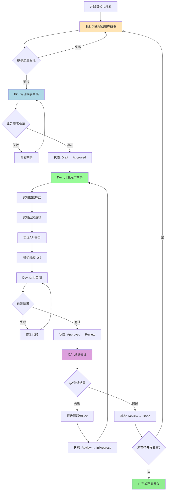

# XIAOMA-CLI™ 自动化用户故事开发流程使用指南

## 概述

本文档详细介绍如何使用XIAOMA-CLI™框架的自动化用户故事开发流程，实现从用户故事创建到QA验收的完全自动化开发循环。

## 🚀 新增功能特性

### 1. 自动化流程编排器 (automation-orchestrator)

- **角色**: 自动化开发流程编排器和质量控制中心
- **图标**: 🤖
- **专长**: 流程自动化、质量门控、状态管理、智能体协调

### 2. 完整的自动化开发循环

- **故事创建**: SM智能体使用增强模板创建详细用户故事
- **故事验证**: PO智能体严格验证业务需求和技术可行性
- **代码开发**: Dev智能体实现功能并进行全面自测
- **QA测试**: QA智能体进行全面的测试验证
- **状态管理**: 自动化的状态转换和质量门控

### 3. 严格的质量控制

- **每个阶段都有明确的通过标准**
- **自动化的质量检查和验证**
- **问题自动识别和修复机制**
- **完整的进度跟踪和报告**

## 🎯 自动化流程详细说明

### 流程概览



### 用户故事状态定义

| 状态       | 含义                 | 负责方   | 转换条件                     |
| ---------- | -------------------- | -------- | ---------------------------- |
| Draft      | 故事已创建，等待验证 | SM       | 故事格式和内容验证通过       |
| Approved   | 故事已验证，可以开发 | PO       | 业务需求和技术可行性验证通过 |
| InProgress | 正在开发中           | Dev      | 开发工作进行中               |
| Review     | 开发完成，等待测试   | Dev → QA | 开发自测全部通过             |
| Done       | 所有工作完成         | QA       | QA测试验证全部通过           |

## 🛠️ 使用方法

### 方法1: 启动完全自动化流程

**适用场景**: 需要批量开发多个用户故事，希望完全自动化

```bash
# 1. 切换到自动化编排器
*agent automation-orchestrator

# 2. 启动自动化开发流程
*start-auto-development

# 流程将自动执行：
# SM创建故事 → PO验证 → Dev开发 → QA测试 → 循环直到完成
```

### 方法2: 手动执行单个开发循环

**适用场景**: 希望对每个故事进行精确控制

```bash
# 1. 切换到自动化编排器
*agent automation-orchestrator

# 2. 手动执行单个故事循环
*execute-story-cycle

# 每个循环包含完整的 SM → PO → Dev → QA 流程
```

### 方法3: 分步骤手动控制 (原有方式)

**适用场景**: 希望完全手动控制每个步骤

```bash
# 阶段1: 创建用户故事
*agent sm
*draft-enhanced

# 阶段2: 验证故事
*agent po
*validate-story-draft {story_file}

# 阶段3: 开发实现
*agent dev
*develop-story
*run-tests

# 阶段4: QA测试
*agent qa
*review {story_file}
```

## 📋 质量门控标准

### 故事创建质量门控

**必须满足的条件**:

- ✅ 故事格式符合增强模板要求
- ✅ 数据库实体映射完整准确
- ✅ API接口规范详细完整
- ✅ 请求响应示例具体明确
- ✅ 验收标准清晰可测试
- ✅ 任务分解合理可执行

### 故事验证质量门控

**必须满足的条件**:

- ✅ 与PRD业务需求完全对齐
- ✅ 技术实现方案可行
- ✅ 验收标准可验证
- ✅ 故事规模适当(一个迭代内完成)
- ✅ 依赖关系明确

### 开发完成质量门控

**必须满足的条件**:

- ✅ 所有功能需求已实现
- ✅ 单元测试覆盖率 ≥ 80%
- ✅ 集成测试全部通过
- ✅ API接口功能正常
- ✅ 数据库操作正确
- ✅ 代码质量达标

### QA验收质量门控

**必须满足的条件**:

- ✅ 所有验收标准满足
- ✅ 功能测试全部通过
- ✅ API契约测试通过
- ✅ 数据完整性验证通过
- ✅ 性能要求满足
- ✅ 安全测试通过

## 🔧 智能体命令详解

### automation-orchestrator 智能体

| 命令                                    | 功能                   | 使用场景         |
| --------------------------------------- | ---------------------- | ---------------- |
| `*start-auto-development`               | 启动完全自动化开发流程 | 批量开发多个故事 |
| `*execute-story-cycle`                  | 执行单个故事开发循环   | 单个故事精确控制 |
| `*validate-quality-gate <stage>`        | 验证特定阶段质量门控   | 质量检查         |
| `*manage-story-status <story> <action>` | 管理故事状态转换       | 状态管理         |
| `*generate-progress-report`             | 生成开发进度报告       | 进度跟踪         |
| `*check-completion-status`              | 检查整体完成状态       | 项目完成度评估   |

### sm 智能体 (增强版)

| 命令              | 功能               | 说明                          |
| ----------------- | ------------------ | ----------------------------- |
| `*draft-enhanced` | 创建增强版用户故事 | 包含数据库和API设计的详细故事 |
| `*draft`          | 创建标准用户故事   | 原有的标准故事模板            |

### po 智能体 (增强版)

| 命令                            | 功能         | 说明                         |
| ------------------------------- | ------------ | ---------------------------- |
| `*validate-story-draft {story}` | 验证故事草稿 | 使用增强验证清单进行全面检查 |

### dev 智能体 (增强版)

| 命令             | 功能         | 说明                        |
| ---------------- | ------------ | --------------------------- |
| `*develop-story` | 开发用户故事 | 实现完整的数据库+业务+API层 |
| `*run-tests`     | 运行自测     | 全面的单元测试和集成测试    |

### qa 智能体 (增强版)

| 命令              | 功能       | 说明                         |
| ----------------- | ---------- | ---------------------------- |
| `*review {story}` | QA测试验收 | 使用增强验收清单进行全面测试 |

## 📊 进度跟踪和报告

### 实时进度监控

系统自动跟踪以下指标：

- **故事状态分布**: Draft, Approved, InProgress, Review, Done
- **开发效率**: 每个故事的开发周期时间
- **质量指标**: 缺陷率、返工率、测试通过率
- **团队协作**: 智能体间协作效率

### 自动生成报告

- **每日进度报告**: `docs/reports/daily-progress-{date}.md`
- **质量指标报告**: `docs/reports/quality-metrics.md`
- **完成度报告**: `docs/reports/completion-summary.md`

## 🚨 错误处理和恢复

### 自动重试机制

- **故事创建失败**: 最多重试3次
- **验证失败**: 返回修复后重新验证
- **开发失败**: 最多尝试5次修复
- **QA失败**: 返回开发阶段修复

### 升级机制

- **连续失败**: 超过重试次数后升级到项目经理
- **重大问题**: 架构设计问题升级到架构师
- **阻塞问题**: 外部依赖问题升级到产品经理

### 人工介入点

- **质量门控失败**: 人工review和决策
- **技术难题**: 人工技术支持
- **业务变更**: 人工需求澄清

## 📝 最佳实践建议

### 前置准备

1. **确保数据库设计完成**: `docs/database/database-design.md`
2. **生成基础代码框架**: 实体类、Mapper接口等
3. **准备测试环境**: 数据库、中间件、配置等
4. **Epic分解完成**: 用户故事列表清晰

### 流程优化

1. **批量处理**: 对于类似功能的故事可以批量处理
2. **并行开发**: 无依赖的故事可以并行开发
3. **预检查**: 在开始前验证所有前置条件
4. **快速反馈**: 问题发现后立即修复

### 质量保证

1. **严格门控**: 不满足质量标准的坚决不通过
2. **完整测试**: 确保测试覆盖所有场景
3. **文档同步**: 代码实现与文档保持一致
4. **持续改进**: 基于反馈不断优化流程

## 🔍 故障排除

### 常见问题

**问题1: 故事创建质量不达标**

- **现象**: 反复创建失败
- **解决**: 检查Epic质量，确保需求描述清晰
- **预防**: 提升Epic分解质量

**问题2: PO验证反复失败**

- **现象**: 业务需求不匹配
- **解决**: 澄清PRD需求，调整故事内容
- **预防**: 加强PRD质量控制

**问题3: 开发自测不通过**

- **现象**: 测试覆盖率不足或测试失败
- **解决**: 补充测试用例，修复代码问题
- **预防**: 提升开发代码质量

**问题4: QA测试反复失败**

- **现象**: 功能不满足验收标准
- **解决**: 详细分析验收标准，修复功能缺陷
- **预防**: 加强开发阶段的需求理解

### 性能优化

**数据库操作优化**:

- 使用批量操作
- 优化查询语句
- 合理使用索引
- 避免N+1查询

**API性能优化**:

- 合理的响应时间控制
- 适当的缓存策略
- 数据传输优化
- 并发处理优化

## 📖 使用示例

### 示例1: 用户注册功能自动化开发

```bash
# 1. 启动自动化流程
*agent automation-orchestrator
*start-auto-development

# 系统自动执行：
# ✅ SM创建"用户注册"故事 (包含users表设计和API规范)
# ✅ PO验证业务需求和技术可行性
# ✅ Dev实现Entity、Service、Controller层代码
# ✅ Dev运行单元测试和集成测试
# ✅ QA执行功能测试、API测试、安全测试
# ✅ 故事状态变更为Done

# 2. 自动进入下一个故事开发循环
```

### 示例2: 产品管理功能批量开发

```bash
# 1. 批量开发产品相关的多个故事
*agent automation-orchestrator
*start-auto-development

# 系统将依次自动开发：
# - 产品创建功能 (products表设计 + CRUD API)
# - 产品分类功能 (categories表设计 + 关联API)
# - 产品搜索功能 (搜索API + 性能优化)
# - 产品评价功能 (reviews表设计 + 评价API)

# 每个故事都经过完整的质量门控验证
```

## 🎉 总结

通过XIAOMA-CLI™的自动化用户故事开发流程，你可以：

1. **显著提升开发效率**: 自动化的流程减少了人工协调时间
2. **保证开发质量**: 严格的质量门控确保每个环节都达标
3. **降低沟通成本**: 标准化的流程减少了团队间的沟通成本
4. **提高交付可靠性**: 完整的测试验证确保交付质量

现在你可以专注于业务逻辑的实现，而将流程管理和质量控制交给自动化系统！

---

**版本信息**:

- 版本：2.0.0
- 更新日期：2024年
- 作者：Automation Enhancement Team
